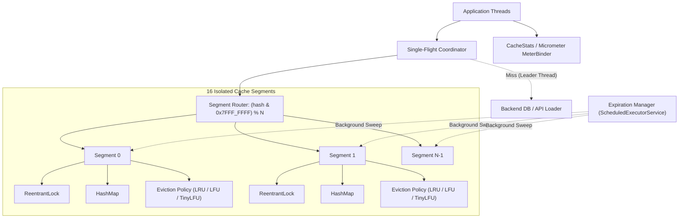

# ConcurrentLRUCache

A high-performance, thread-safe in-memory caching engine built in Java 21. Engineered for high-concurrency production workloads, it combines 16-way segmented lock striping to eliminate global lock contention, pluggable eviction policies (**LRU**, **LFU**, and **Window-TinyLFU** with Count-Min Sketch admission filtering), race-safe hybrid TTL expiration, single-flight request coalescing to eliminate cache stampedes, and deep observability with optional Micrometer integration.

---

## Quick Start

```java
// Standard segmented cache with 10,000 capacity (LRU by default)
try (ConcurrentLRUCache<String, String> cache = new ConcurrentLRUCache<>(10_000)) {
    // Basic operations
    cache.put("user:42", "Alice");
    cache.put("session:42", "active", Duration.ofMinutes(5)); // Per-entry TTL

    Optional<String> user = cache.get("user:42");

    // Single-Flight Request Coalescing: concurrent misses share ONE database call
    String data = cache.get("expensive:query", key -> fetchFromDatabase(key), Duration.ofMinutes(10));

    // Granular observability & statistics
    CacheStats stats = cache.getStats();
    System.out.printf("Hit Rate: %.2f%% | Coalesced Loads: %d%n",
            stats.hitRate() * 100, stats.coalescedLoads());
}

// Instantiate with Window-TinyLFU eviction for scan-resistant workloads
try (ConcurrentLRUCache<String, String> tinyLfuCache =
        new ConcurrentLRUCache<>(10_000, PolicyType.WINDOW_TINY_LFU)) {
    tinyLfuCache.put("item:100", "payload");
}
```

---

## Features

- **Segmented Concurrency:** 16-way lock striping partitions key space into isolated segments, eliminating global lock contention and serial read bottlenecks.
- **Pluggable Eviction Engine:** Unified `EvictionPolicy` abstraction supporting:
  - **LRU (Least Recently Used):** High temporal locality with $O(1)$ doubly-linked list ordering.
  - **LFU (Least Frequently Used):** Frequency tracking with $O(1)$ doubly-linked frequency bucket lists and FIFO tie-breaking.
  - **Window-TinyLFU:** 4-way Count-Min Sketch admission filter with window (1%), probation (19%), and protected (80%) SLRU queues protecting against scan pollution.
- **Race-Safe TTL & Hybrid Expiration:** Bounded lazy expiration on `get()` paired with a non-overlapping `ScheduledExecutorService` background sweep.
- **Single-Flight Coalescing (`getOrLoad`):** Deduplicates concurrent misses for identical keys so only one backend loader executes while concurrent callers await the result without holding cache segment locks.
- **Production Observability:** Per-segment metric breakdowns, admission/rejection telemetry, coalescing ratios, and optional **Micrometer `MeterBinder`** export (`ConcurrentLRUCacheMetrics`).

---

## Architecture



---

## Operations & Complexity

| Operation | Complexity | Description |
|---|---|---|
| `get(key)` | $O(1)$ | Hash lookup, lazy TTL expiration check, and policy recency/frequency update within segment. |
| `put(key, value)` | $O(1)$ | Hash insertion/update, TTL recording, and segment capacity eviction if required. |
| `get(key, loader)` | $O(1) + T_{\text{loader}}$ | Single-flight coalescing check; executes loader once on miss and populates cache non-blockingly. |
| `remove(key)` | $O(1)$ | Hash removal and policy node unlinking within target segment. |
| `containsKey(key)` | $O(1)$ | Segment hash lookup and non-mutating expiration evaluation. |
| `clear()` | $O(N)$ | Multi-lock acquisition across all $N$ segments in deterministic order to prevent deadlocks. |

---

## Performance & JMH Benchmarks

Performance was characterized using **JMH (Java Microbenchmark Harness 1.37)** on **Java 21 / OpenJDK 24**, executed across 3 independent JVM forks with 10 measurement iterations each ($N=30$), comparing `ConcurrentLRUCache` against **Caffeine 3.1.8** under identical hardware and workload parameters.

**Test Environment:** Windows 11 Home, 13th Gen Intel Core i5-13420H (8 physical cores: 4 P-cores + 4 E-cores / 12 threads), 10,000 capacity, 10,000 key space, 50% pre-warmed.

### 1. Workload Matrix (8 Concurrent Worker Threads)

| Key Distribution | Workload Mix | Caffeine (ops/sec) | ConcurrentLRUCache (ops/sec) | Ratio (% of Caffeine) |
|---|---|---|---|---|
| **UNIFORM** | **READ_HEAVY (95% GET / 5% PUT)** | $3,506,751 \pm 289,410$ | $2,442,149 \pm 90,068$ | **69.6%** |
| **UNIFORM** | **BALANCED (80% GET / 20% PUT)** | $3,430,754 \pm 381,421$ | $2,467,653 \pm 43,825$ | **71.9%** |
| **UNIFORM** | **WRITE_HEAVY (50% GET / 50% PUT)** | $3,803,844 \pm 185,679$ | $2,879,588 \pm 68,199$ | **75.7%** |
| **ZIPFIAN ($s=1.0$)** | **READ_HEAVY (95% GET / 5% PUT)** | $3,504,951 \pm 423,780$ | $2,315,287 \pm 50,443$ | **66.1%** |
| **ZIPFIAN ($s=1.0$)** | **BALANCED (80% GET / 20% PUT)** | $3,913,499 \pm 460,444$ | $2,494,541 \pm 47,758$ | **63.7%** |
| **ZIPFIAN ($s=1.0$)** | **WRITE_HEAVY (50% GET / 50% PUT)** | $3,683,251 \pm 370,371$ | $2,809,590 \pm 52,527$ | **76.3%** |

### 2. Thread Scaling (Uniform Read-Heavy Workload)

| Thread Count | Caffeine (ops/sec) | ConcurrentLRUCache (ops/sec) | Scaling Factor |
|---|---|---|---|
| **1 Thread** | $4,305,805 \pm 319,829$ | $2,500,286 \pm 114,670$ | **1.00x** (baseline) |
| **2 Threads** | $4,109,883 \pm 213,769$ | $1,797,161 \pm 58,284$ | **0.72x** |
| **4 Threads** | $4,524,772 \pm 548,241$ | $2,281,041 \pm 110,973$ | **0.91x** |
| **8 Threads** | $3,706,489 \pm 449,834$ | $2,404,518 \pm 139,966$ | **0.96x** |
| **12 Threads** | $3,547,933 \pm 241,937$ | $2,625,942 \pm 62,695$ | **1.05x** |
| **16 Threads** | $3,665,445 \pm 240,169$ | $2,758,073 \pm 111,393$ | **1.10x** |
| **32 Threads** | $3,262,700 \pm 183,534$ | $2,753,263 \pm 143,002$ | **1.10x** |

### 3. Honest Architectural Comparison with Caffeine

- **Where Caffeine Leads (Read-Heavy Traffic):** Caffeine uses an asynchronous, lock-free read buffer (`StripedBuffer` / `MPSC` queue). Reads in Caffeine only execute a hash lookup and record access events to thread-local ring buffers drained asynchronously by background worker threads. `ConcurrentLRUCache` performs recency updates synchronously inside the segment lock, resulting in ~66–70% of Caffeine's throughput on pure read workloads.
- **Where ConcurrentLRUCache Competes Closely (Write/Mutation-Heavy Traffic):** Under write-heavy access (50% writes), Caffeine must also coordinate structural mutation. `ConcurrentLRUCache` achieves **2.81M – 2.88M ops/sec (75–76% of Caffeine)** due to clean per-segment lock isolation.
- **Simplicity and Predictable Memory:** `ConcurrentLRUCache` has zero background maintenance queue backpressure risk, no unbounded buffer accumulation, and immediate synchronous eviction.

---

## Design Decisions & Tradeoffs

1. **Per-Segment LRU Ordering vs. Global Exact LRU:**
   - *Decision:* Partitioning the cache into 16 independent segments divides capacity equally ($C_{\text{seg}} = \lceil C / 16 \rceil$) and maintains eviction state per segment.
   - *Tradeoff:* Global exact LRU ordering becomes per-segment approximate LRU. In exchange, lock contention is distributed 16-fold, eliminating single-lock multi-core bottlenecks.
2. **Synchronous Segment Locking vs. Asynchronous Read Buffering:**
   - *Decision:* Synchronous `ReentrantLock` acquisition per segment for recency and eviction updates.
   - *Tradeoff:* Sacrifices lock-free read speeds (compared to Caffeine's ring buffers) in favor of deterministic memory bounds, strict immediate eviction, and zero background thread maintenance overhead.
3. **Window-TinyLFU Count-Min Sketch with Periodic Halving:**
   - *Decision:* Implements a 4-hash Count-Min Sketch with a periodic halving/decay reset when cumulative additions reach total capacity.
   - *Tradeoff:* Provides $O(1)$ frequency estimation in compact memory (4 bits per counter) and prevents historical frequency bias ("cache pollution") without storing 64-bit access timestamps per node.
4. **Non-Blocking Single-Flight Coordinator:**
   - *Decision:* The `SingleFlightCoordinator` coordinates concurrent loader calls using atomic futures and releases all cache segment locks before executing user-supplied loader functions.
   - *Tradeoff:* Slightly higher allocation cost per missed key during concurrent stampedes in exchange for absolute protection against thread-pool starvation and cache lock deadlocks.

---

## Build, Test & Benchmark

### Build & Run Tests
```bash
# Run the 61-test JUnit 5 suite
mvn clean test

# Verify Spotless code formatting (Google Java Format / AOSP)
mvn spotless:check

# Package application and generate JaCoCo coverage report
mvn verify
```

### Reproduce JMH Benchmarks
```bash
# 1. Package the self-contained JMH benchmark uber jar
mvn clean package -DskipTests

# 2. Run workload matrix benchmarks (8 threads, uniform + Zipfian)
java -jar target/benchmarks.jar "jmh.CacheBenchmarkJmh" -f 3 -wi 5 -i 10 -w 1 -r 1 -t 8

# 3. Run thread scaling benchmarks (1 to 32 threads)
java -jar target/benchmarks.jar "jmh.ThreadScalingBenchmark" -f 3 -wi 5 -i 10 -w 1 -r 1
```

---

## Possible Future Extensions

- Lock-free read buffers with batched execution draining for further read-heavy throughput optimization.