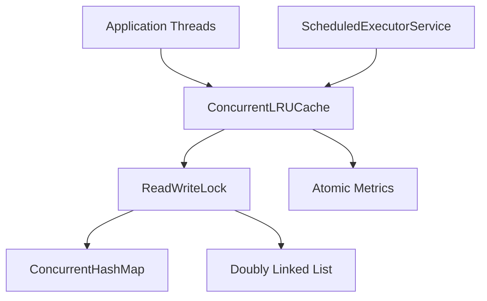

# ConcurrentLRUCache

A high-performance concurrent LRU cache for Java 21 with TTL expiration, thread-safe access, metrics, tests, and benchmarking.

**Benchmark:** 1.11M operations/sec at 200 concurrent threads.

## Project Overview

`ConcurrentLRUCache` is a thread-safe in-memory cache that combines
LRU eviction, TTL expiration, concurrent access, and cache metrics.

The implementation uses Java concurrency primitives to support
multiple threads accessing the cache simultaneously while maintaining
bounded cache capacity.

```java
try (ConcurrentLRUCache<String, String> cache = new ConcurrentLRUCache<>(1_000)) {
    cache.put("user:42", "Ada");
    cache.put("session:42", "active", Duration.ofMinutes(5));

    cache.get("user:42").ifPresent(System.out::println);
}
```

## Features

- Thread-safe `put`, `get`, `remove`, `containsKey`, `size`, and `clear`
- LRU eviction when capacity is exceeded
- Optional TTL per entry
- Lazy expiration during access
- Scheduled background cleanup
- Hit, miss, eviction, request, and expiration metrics
- JUnit stress tests and a simple benchmark runner

## Concurrency Design

The cache coordinates structural updates with `ReentrantReadWriteLock`. `get` uses the write lock because successful reads move nodes to the front of the LRU list. Pure read operations use the read lock where they do not mutate recency.

Metrics are held in `AtomicLong` counters, allowing request statistics to be updated safely without folding them into the main cache state.

## Time Complexity

| Operation | Complexity |
| --- | --- |
| `get` | O(1) |
| `put` | O(1) |
| `remove` | O(1) |
| `containsKey` | O(1) |
| `clear` | O(n) |

## Architecture Diagram



## Build and Test

```bash
mvn test
mvn jacoco:report
mvn spotless:check
```

Coverage output is generated under `target/site/jacoco`.

## Benchmark

```bash
mvn -DskipTests compile exec:java
```

The benchmark simulates 1, 10, 50, 100, and 200 threads, then writes a markdown report to `docs/benchmark-results.md`.

## Project Structure

```text
ConcurrentLRUCache/
|-- src/main/java/cache/
|-- src/test/java/cache/
|-- benchmark/benchmark/
|-- docs/
|-- README.md
`-- pom.xml
```
