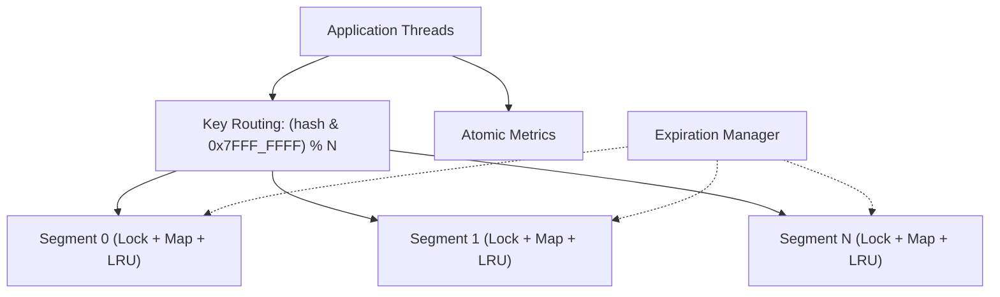

# ConcurrentLRUCache

A Java 21 high-throughput concurrent in-memory LRU cache featuring segmented lock striping, per-entry TTL expiration, metrics instrumentation, JMH microbenchmarks, and comparative evaluations against Caffeine.

## Project Overview

`ConcurrentLRUCache` is an in-memory caching engine engineered for high-concurrency workloads. It partitions key space across $N$ isolated segments (default 16), each managing an internal hash map, a doubly linked recency list, and a dedicated `ReentrantLock`.

```java
try (ConcurrentLRUCache<String, String> cache = new ConcurrentLRUCache<>(10_000)) {
    cache.put("user:42", "Ada");
    cache.put("session:42", "active", Duration.ofMinutes(5));

    cache.get("user:42").ifPresent(System.out::println);
}
```

## Features

- **Segmented Concurrency:** 16-way lock striping eliminating global lock serialization on cache reads and writes.
- **LRU Eviction:** Bounded capacity per segment with instant $O(1)$ node recency updates.
- **Per-Entry TTL:** Optional expiration duration per key, evaluated lazily on access.
- **Background Expiration:** Scheduled cleanup sweeping expired entries on a configurable fixed delay.
- **Metrics Snapshot:** Non-blocking atomic counters tracking hits, misses, evictions, expired removals, and hit rates.
- **JMH Benchmarking Suite:** Microbenchmarks covering thread scaling (1 to 32 threads), uniform and Zipfian key distributions, and head-to-head Caffeine comparisons.

## Architecture



## Time Complexity

| Operation | Complexity | Description |
|---|---|---|
| `get` | $O(1)$ | Hash lookup, expiration check, and move-to-front within segment |
| `put` | $O(1)$ | Hash insertion/update and tail eviction within segment |
| `remove` | $O(1)$ | Hash removal and unlinking from segment LRU list |
| `containsKey` | $O(1)$ | Segment hash lookup and expiration check |
| `clear` | $O(n)$ | Ordered multi-lock acquisition across all segments |

## Build and Test

```bash
mvn test
mvn jacoco:report
mvn spotless:check
```

Coverage report is generated under `target/site/jacoco`.

## Benchmarking (JMH)

To build and run the JMH benchmark harness:

```bash
# Build fat benchmark jar
mvn clean package -DskipTests

# Run JMH workload matrix (8 threads, uniform + Zipfian)
java -jar target/benchmarks.jar "jmh.CacheBenchmarkJmh" -f 3 -wi 5 -i 10 -w 1 -r 1 -t 8

# Run JMH thread scaling suite (1 to 32 threads)
java -jar target/benchmarks.jar "jmh.ThreadScalingBenchmark" -f 3 -wi 5 -i 10 -w 1 -r 1
```

Full benchmark methodology, results tables, and Caffeine comparisons are documented in `docs/04_BENCHMARKS.md`.