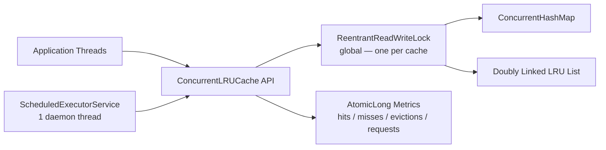
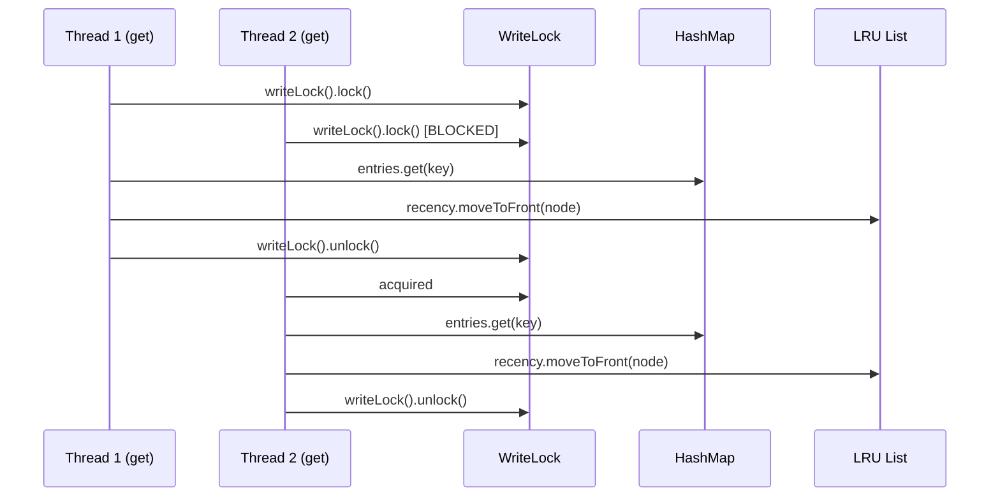

# Architecture — Phase 0 Snapshot

Recorded: Phase 0 — Repository Discovery and Baseline

This document captures the architecture **as found** before any Phase 1 modifications.

---

## Overview

`ConcurrentLRUCache` is a single-class in-memory cache using:

- `ConcurrentHashMap<K, CacheNode<K,V>>` for O(1) key lookup
- A custom `DoublyLinkedList<K,V>` for LRU recency ordering
- A single `ReentrantReadWriteLock` for structural coordination
- `AtomicLong` counters for metrics
- An `ExpirationManager` owning a scheduled executor for background TTL cleanup

---

## Current Architecture Diagram



---

## Critical Concurrency Issue



**Every cache hit requires the write lock.** Two concurrent reads can never proceed in parallel — they must serialize. This is the primary throughput bottleneck under concurrency.

---

## State Ownership

| State | Owner | Thread-safe alone? |
|---|---|---|
| `entries` (ConcurrentHashMap) | `ConcurrentLRUCache` | Yes — but correctness requires lock because it must stay in sync with LRU list |
| `recency` (DoublyLinkedList) | `ConcurrentLRUCache` | No — unsynchronized |
| `lock` (ReentrantReadWriteLock) | `ConcurrentLRUCache` | Guards map + list together |
| `hits/misses/evictions/...` (AtomicLong) | `ConcurrentLRUCache` | Yes — updated without lock |
| `executor` (ScheduledExecutorService) | `ExpirationManager` | Yes |

---

## Data Flow for `get(key)`

```text
get(key)
  ├── requests.incrementAndGet()          [atomic, no lock]
  ├── lock.writeLock().lock()             [EXCLUSIVE]
  ├── entries.get(key) → node or null
  │    ├── null → misses.incrementAndGet(), return empty
  │    └── node found:
  │         ├── node.isExpired(now)?
  │         │    └── true → removeNode(node), expiredRemovals++, misses++, return empty
  │         └── not expired:
  │              ├── recency.moveToFront(node)   [linked list mutation]
  │              ├── hits.incrementAndGet()
  │              └── return Optional.of(node.value)
  └── lock.writeLock().unlock()
```

---

## Data Flow for `put(key, value, ttl)`

```text
put(key, value, ttl)
  ├── validateTtl(ttl)
  ├── lock.writeLock().lock()             [EXCLUSIVE]
  ├── entries.get(key) → existing?
  │    ├── yes → existing.update(value, ttl), recency.moveToFront(existing), return
  │    └── no → new CacheNode, entries.put, recency.addToFront, evictOverflow()
  └── lock.writeLock().unlock()
```

---

## TTL Flow

```text
CacheNode.expiresAtNanos
  ├── null ttl → Long.MAX_VALUE (never expires)
  └── ttl provided → System.nanoTime() + ttl.toNanos()
       └── overflow guard: if result < now → Long.MAX_VALUE

Lazy expiration: checked in get(), isExpired(System.nanoTime())
Scheduled expiration: ExpirationManager calls removeExpiredEntries() periodically
  └── acquires write lock, scans all entries, removes expired ones
```
