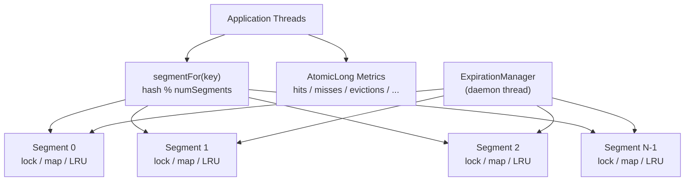

# Concurrency Design — Phase 1

---

## 1. The Problem: Global Write Lock on Every Cache Hit

The original `ConcurrentLRUCache` (v1) takes the global write lock on every `get()` call:

```java
// v1: get() — EVERY read requires exclusive write lock
lock.writeLock().lock();
try {
    CacheNode<K, V> node = entries.get(key);
    ...
    recency.moveToFront(node);  // ← this is why
    ...
} finally {
    lock.writeLock().unlock();
}
```

**Root cause:** `DoublyLinkedList.moveToFront()` modifies pointer fields on shared `CacheNode` objects. The list is not thread-safe, so an exclusive lock is required even for cache hits.

**Consequence:** All concurrent reads serialize. N threads doing cache hits proceed one at a time. Throughput does not scale with thread count for read-heavy workloads.

---

## 2. Design Goal

Allow concurrent reads to proceed in parallel by **reducing the scope of each lock to a subset of the keyspace**, not the entire cache.

---

## 3. Chosen Design: Segmented/Striped Concurrency

The cache is divided into N independent segments. Each segment owns:

- Its own `HashMap<K, CacheNode<K,V>>` (plain, not concurrent — protected by its own lock)
- Its own `DoublyLinkedList<K,V>` for LRU ordering
- Its own `ReentrantLock` (not ReadWriteLock — explained below)
- A local capacity (= total capacity / numSegments)

Key routing:

```text
segment_index = (key.hashCode() & 0x7FFFFFFF) % numSegments
```

Global metrics remain shared `AtomicLong` counters.

### Architecture Diagram



---

## 4. Why `ReentrantLock` Instead of `ReentrantReadWriteLock`?

In the segmented design, every operation on a segment (including `get`) requires a write to the LRU list. There are no lock-free read paths within a segment — every cache hit mutates the list. Therefore:

- The read-lock of a `ReadWriteLock` is never usable for `get()`.
- `containsKey()` in the old design used the read lock because it skipped LRU mutation. In the new design we keep that behavior — `containsKey()` does not update recency, so it uses a plain try-lock or could be read-only. For simplicity and consistency with the old API semantics, `containsKey()` still holds the segment lock briefly to check the map.
- `ReentrantLock` has lower overhead than `ReentrantReadWriteLock` when there is no read-write distinction.

---

## 5. ⚠️ Explicit Tradeoff: Per-Segment LRU, Not Global Exact LRU

> **This is a documented semantic change. It is not a bug. It is an inherent tradeoff of segmentation.**

### What changes

| Property | v1 (global lock) | v2 (segmented) |
|---|---|---|
| LRU ordering | **Exact global ordering** across all entries | **Per-segment approximate ordering** |
| Eviction target | Globally least recently used entry | Locally least recently used within the segment that overflowed |
| Hot key imbalance | Not possible (one keyspace) | Possible — a segment with hot keys may evict more aggressively |
| Lock contention | All threads share one write lock | Threads hitting different segments are fully parallel |

### Example

With 4 segments and entries A (segment 0), B (segment 1), C (segment 2):

- If A was globally the LRU but segment 0 is not full, B (locally LRU in segment 1) may be evicted first when segment 1 overflows.
- This differs from global LRU, which would evict A.

### Why this is acceptable

1. Global exact LRU requires a single ordered structure, which forces serialization.
2. Per-segment LRU is a well-established tradeoff used in production caches (e.g., the segment map in `ConcurrentHashMap` pre-Java 8, segmented Caffeine implementations, Guava's `LocalCache`).
3. For most practical workloads the difference in cache hit rate between global and per-segment LRU is small, and the throughput gain from reduced contention is significant.
4. The tradeoff is explicitly documented here and in test comments.

---

## 6. Capacity Allocation

Total capacity is distributed as evenly as possible across segments:

```text
base = capacity / numSegments
remainder = capacity % numSegments
segment[i].capacity = base + (i < remainder ? 1 : 0)
```

This guarantees the sum of segment capacities equals total capacity.

---

## 7. Segment Count Selection

Default: **16 segments**.

Rationale:
- 16 is a power of 2 (though we do not use bit-mask routing; we use `%` for correctness with arbitrary capacity).
- 16 segments means up to 16 threads can proceed in parallel on different segments.
- Increasing segments beyond the number of available threads provides diminishing returns.
- This is configurable via the constructor for benchmarking purposes.

---

## 8. Thread Safety Guarantees (Happens-Before)

For each segment, all operations on that segment's map and LRU list are performed under that segment's lock. This provides the following happens-before guarantees:

- A `put(k, v)` happens-before any subsequent `get(k)` that observes the value.
- A `remove(k)` happens-before any subsequent `get(k)` that returns empty.
- `clear()` acquires all segment locks (in index order to prevent deadlock) and is fully linearizable — after `clear()` returns, all `get()` calls return empty.

**No cross-segment happens-before is required** because operations on different keys in different segments are independent.

---

## 9. Potential Races and Mitigations

| Scenario | Risk | Mitigation |
|---|---|---|
| Concurrent `put` + `remove` on same key | One wins, one loses — depends on lock order | Resolved by per-segment lock; only one holds the lock at a time |
| Concurrent `clear` + `put` | `clear` might miss the new entry or `put` into a cleared segment | `clear` holds all locks sequentially; `put` on a different segment can proceed but `clear` will reach it |
| Expiration background thread vs `get` | Expiration removes entry that `get` is about to return | Both are under the same segment lock; one proceeds, one finds the entry already gone |
| Metrics overcounting/undercounting | AtomicLong update races with lock release | Acceptable — metrics are approximate by design; `AtomicLong` provides atomicity but not cross-metric consistency |

---

## 10. Executor Shutdown

`ExpirationManager` is unchanged. It owns the cleanup scheduler. `shutdown()` / `close()` calls `executor.shutdownNow()`. The scheduled task operates on the cache's `removeExpiredEntries()` method, which now iterates all segments and acquires each segment lock independently. A shutdown racing with a cleanup run is safe — the lock ensures the cleanup cannot observe a partially cleared segment.

---

## 11. invariants Maintained

1. Every key in a segment map corresponds to exactly one node in that segment's LRU list.
2. Every node in a segment's LRU list corresponds to exactly one key in that segment's map.
3. Each segment's size never exceeds its local capacity (enforced by `evictOverflow()` within the write lock).
4. Evicted entries cannot subsequently be returned (they are removed from the map before the lock is released).
5. Expired entries cannot be returned as fresh values (expiry is checked under the segment lock before the value is returned).
6. Background cleanup never corrupts foreground operations (both operate under the same segment lock).
7. `clear()` acquires all segment locks before clearing, so any concurrent `put` that started before `clear()` completes is either reflected in the cleared cache (if `put` finished first) or lost (if `put` arrives after `clear()` — which is the correct behavior for a non-transactional cache).
