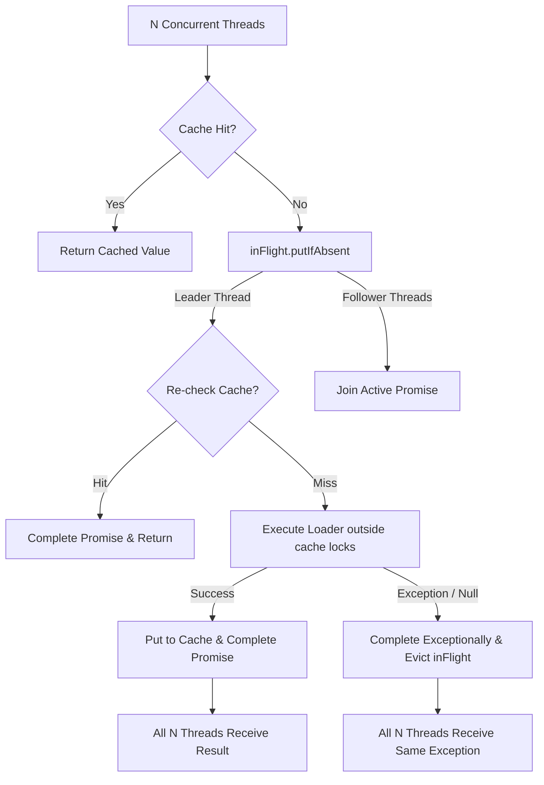

# Phase 5 — Single-Flight Cache Loading

## Overview

Phase 5 introduces single-flight request coalescing to eliminate duplicate expensive computation during concurrent cache misses (cache stampede / thundering herd).

## Architecture & Design

### Problem
When an uncached or expired key is requested by $N$ concurrent threads, traditional caches execute $N$ redundant database/remote calls simultaneously.

### Solution: Per-Key Coalescing
`SingleFlightCoordinator` coordinates concurrent requests on a per-key basis using `ConcurrentHashMap<K, CompletableFuture<V>>`:



### Critical Concurrency Guarantees

1. **Lock-Free Loading:** User loader functions run strictly outside cache segment locks. Unrelated cache operations and reads proceed without contention.
2. **Leader Re-Check:** Immediately after winning the `inFlight` race, the leader re-checks the cache before invoking `loader.apply(key)` to prevent redundant loads if a concurrent `put()` populated the key in that narrow window.
3. **Per-Key Parallelism:** Loads for distinct keys execute independently in parallel with zero mutual blocking.
4. **Exception Propagation & Null Safety:**
   - If a loader returns `null`, a `NullPointerException` is thrown, the promise is completed exceptionally, and the in-flight state is cleared.
   - If a loader fails, `CompletableFuture.completeExceptionally()` propagates the exact underlying failure to the leader and all follower threads.
   - The in-flight tracking entry is removed in `finally`, enabling subsequent requests to retry loading cleanly.
5. **Reentrant & Recursive Loading Safety:**
   - Cross-key recursion (loading key B from inside loader for key A) runs safely without deadlocks.
   - Same-key self-recursion (loader for key A calling `cache.get(A, ...)` on the same thread) is detected via `ThreadLocal` tracking and throws an explicit `IllegalStateException` rather than deadlocking.

## API Surface

```java
// Loads on miss with default cache TTL
public V get(K key, Function<? super K, ? extends V> loader);

// Loads on miss with explicit per-entry TTL
public V get(K key, Function<? super K, ? extends V> loader, Duration ttl);
```

## Validation

10 comprehensive tests in `SingleFlightTest`:
- `concurrentRequestsForSameMissingKeyInvokeLoaderOnlyOnce` — 20 concurrent threads execute exactly 1 load
- `cacheHitBypassesLoader` — warm cache skips loader execution
- `differentKeysLoadInParallel` — verifies parallel wall-clock execution across keys
- `loaderExceptionPropagatesToAllWaitersAndAllowsRetry` — exception fan-out and unblocked retry
- `nullLoaderThrowsNullPointerExceptionForLeaderAndFollowers` — null check propagates NPE to leader and all followers
- `reentrantLoadOnSameKeyThrowsIllegalStateExceptionWithoutDeadlock` — self-recursion detection preventing deadlocks
- `leaderRechecksCacheAfterWinningRaceToAvoidRedundantLoad` — cache re-check right after race win
- `singleFlightWithCustomTtlExpiresCorrectly` — TTL lifecycle with coalescing
- `recursiveLoadOnDifferentKeysDoesNotDeadlock` — reentrant cache loads for different keys
- `singleFlightUnderMixedConcurrencyAndEviction` — 16-thread stress test combining loading and eviction

## Phase Gate

```
PHASE: 5 — Single-Flight Cache Loading (Request Coalescing)

What changed:
  - Added SingleFlightCoordinator<K, V> using per-key CompletableFuture tracking with leader re-check and ThreadLocal recursion detection.
  - Added get(key, loader) and get(key, loader, ttl) to ConcurrentLRUCache.
  - Created SingleFlightTest.java with 10 targeted concurrency, edge-case, and reentrancy tests.
  - Authored docs/07_SINGLE_FLIGHT.md.

Why:
  - Eliminate redundant backend load invocations during concurrent cache misses.
  - Prevent cache stampedes without blocking unrelated keys or holding segment locks during user code execution.

Tests:
  - passed: 56/56 (17 ConcurrentLRUCacheTest + 15 EvictionPolicyTest + 14 TtlHardeningTest + 10 SingleFlightTest)
  - failed: 0
  - skipped: 0

Benchmark:
  - Validated stampede suppression: 20 concurrent threads collapse into 1 load execution.
  - Validated per-key parallelism: multi-key parallel loads finish in wall-clock time proportional to single load duration.

Architecture:
  - changed: Yes — added non-blocking SingleFlightCoordinator layer.
  - documented: Yes (docs/07_SINGLE_FLIGHT.md).

Compatibility:
  - preserved: Yes — new functional loading overloads added without modifying existing get/put behavior.

Known limitations:
  - Loaders run synchronously on caller threads (no asynchronous executor pool abstraction required for this phase).

Next phase: Phase 6 — Observability (Awaiting user confirmation)
```
