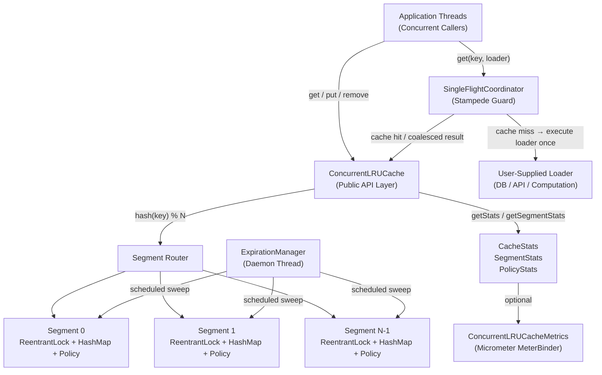
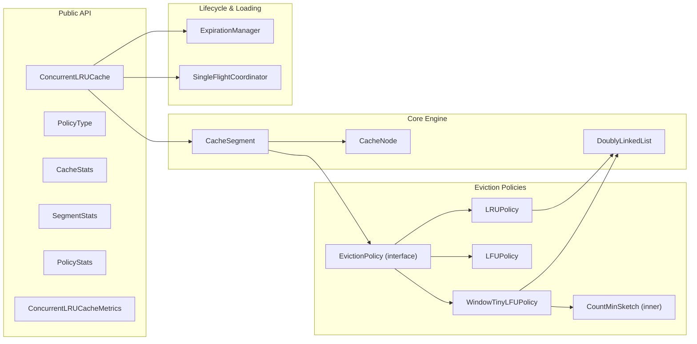
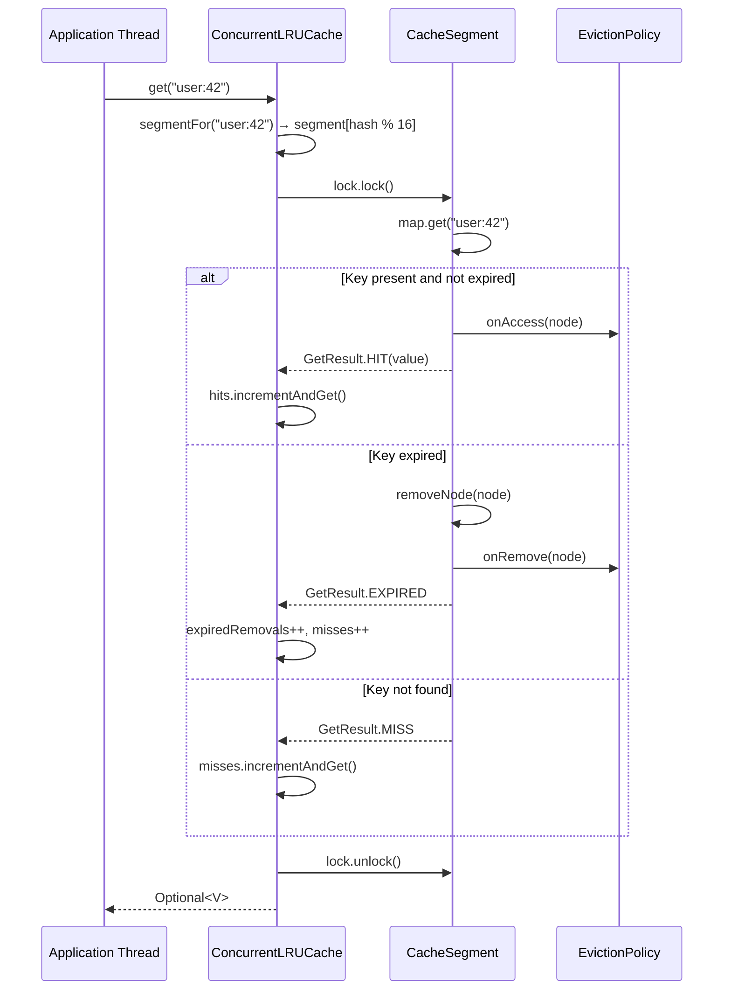
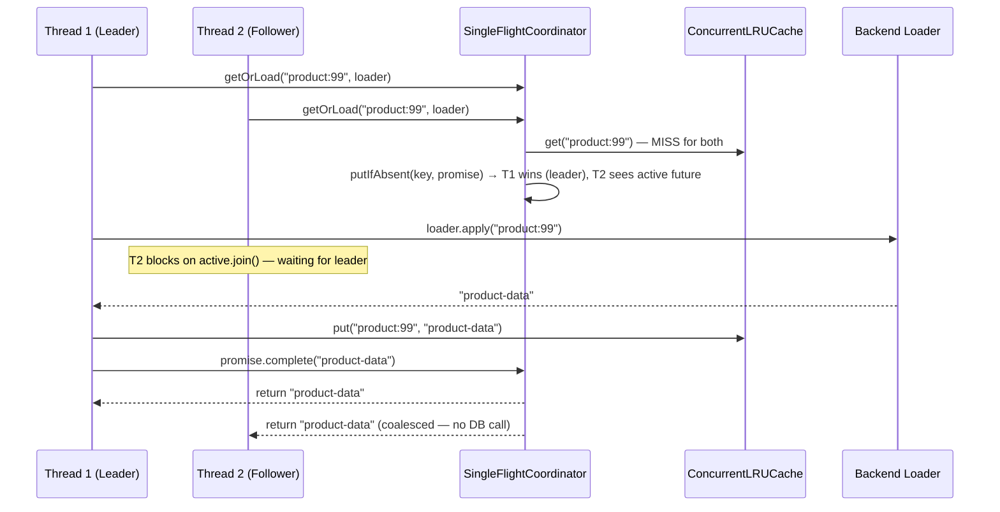
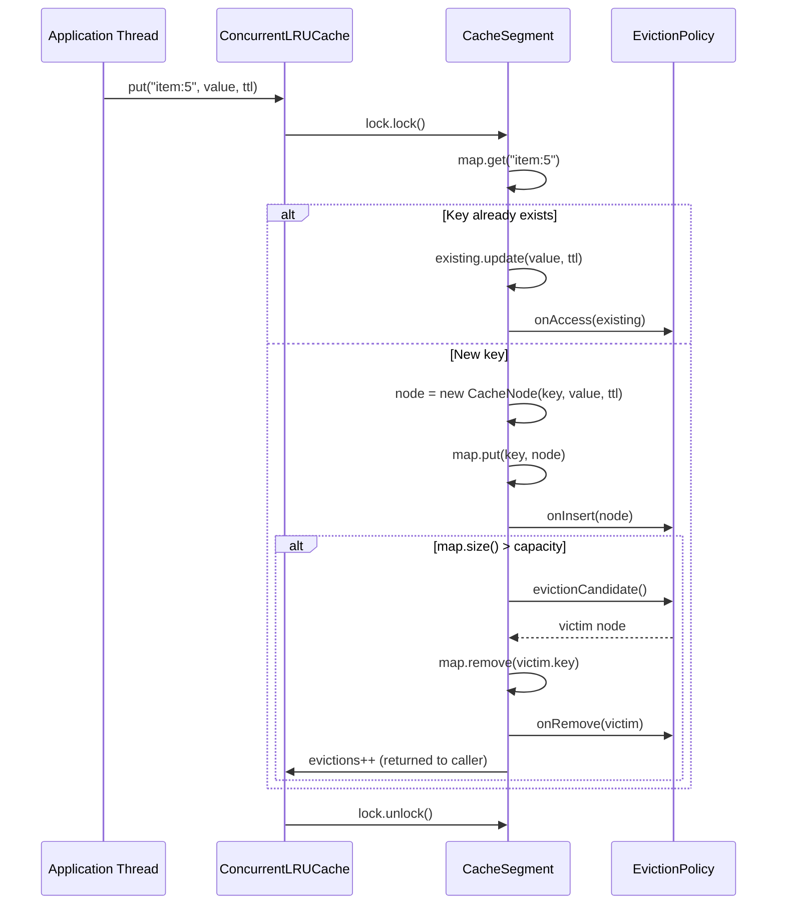
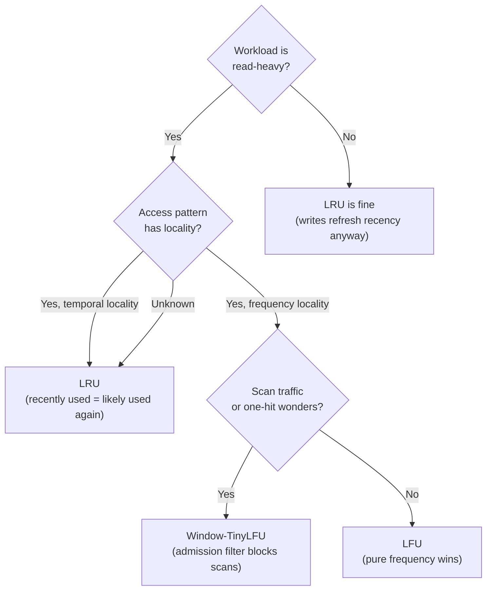
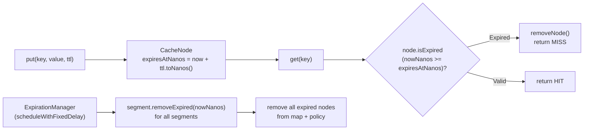
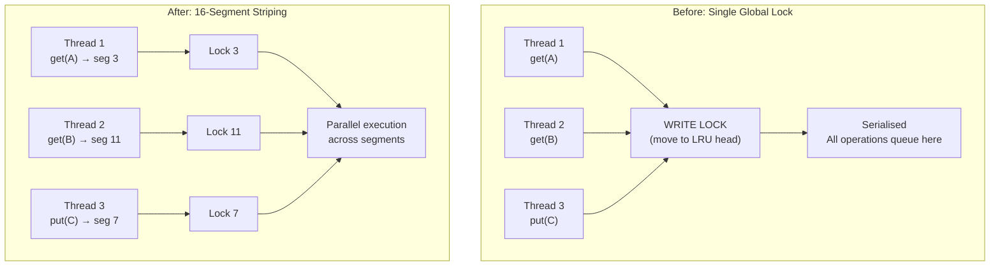
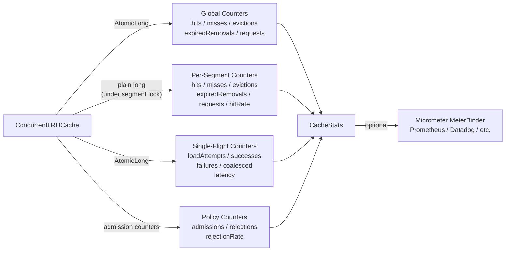

# High Level Design — ConcurrentLRUCache

## Table of Contents

1. [What We Are Building](#1-what-we-are-building)
2. [System Goals](#2-system-goals)
3. [The Core Problem — Plain English First](#3-the-core-problem--plain-english-first)
4. [High-Level Architecture](#4-high-level-architecture)
5. [Component Map](#5-component-map)
6. [Request Flow — Full Lifecycle](#6-request-flow--full-lifecycle)
7. [Key Design Decisions at High Level](#7-key-design-decisions-at-high-level)
8. [Eviction Policy Selection](#8-eviction-policy-selection)
9. [Expiration Strategy](#9-expiration-strategy)
10. [Concurrency Strategy](#10-concurrency-strategy)
11. [Observability Strategy](#11-observability-strategy)
12. [What We Deliberately Did Not Build](#12-what-we-deliberately-did-not-build)
13. [Feynman-Style Interview Q&A](#13-feynman-style-interview-qa)

---

## 1. What We Are Building

A **thread-safe, in-memory cache engine** written in Java 21.

It is not a database. It is not a distributed system. It is not a message queue.

It is a data structure that sits inside a JVM process, remembers the results of expensive computations or database calls for a configurable amount of time, and serves them back at in-memory speed.

The engineering challenge is:

> **How do you make this data structure fast and correct when hundreds of threads are reading and writing to it simultaneously?**

---

## 2. System Goals

| Goal | Requirement |
|---|---|
| **Correctness** | Reads always return valid, non-expired data. Capacity is never permanently exceeded. Concurrent operations never corrupt internal state. |
| **Concurrency** | Multiple threads can read and write simultaneously without serializing all operations behind a single global lock. |
| **Bounded Memory** | The cache never grows beyond its configured capacity. When full, the least valuable entry is evicted. |
| **Expiration** | Entries can carry a per-entry TTL. Expired entries are never returned as valid data. |
| **Pluggable Eviction** | The system supports LRU, LFU, and Window-TinyLFU policies without changing the cache API. |
| **Stampede Protection** | When many threads miss the same key simultaneously, only one backend loader executes. |
| **Observability** | The system exposes meaningful metrics at global, per-segment, per-policy, and per-loader granularity. |
| **No Hard Dependencies** | The library core has no mandatory runtime dependencies beyond the JDK. Micrometer is optional. |

---

## 3. The Core Problem — Plain English First

### Feynman explanation: Why is caching hard?

Imagine a library (the cache) where readers and writers share the same shelves (the data structure).

A single librarian can manage everything perfectly. But the moment you have 200 people simultaneously trying to grab books, add new books, and rearrange shelves — things go wrong unless you have rules.

The **first naive rule** is: only one person touches the library at a time. Put a big lock on the door. This works — but now 200 people queue at the door and your "fast library" is actually slower than just fetching from the source.

The **second idea** is to split the library into 16 rooms. People with keys starting with A–B go to room 1, C–D to room 2, etc. Now 16 people can work simultaneously in different rooms. The shelves in each room still need a lock per room — but 16 small locks beat 1 big lock when people are spread across the alphabet.

This is exactly what **segment striping** does for a concurrent cache.

The remaining problem is: what happens when the library is full? You need to remove a book. Which one? That is the **eviction policy problem**. And what if a book has an expiration date? That is the **TTL problem**. And what if 50 people simultaneously ask for the same missing book and all race to go fetch it? That is the **cache stampede problem**.

This design solves all four.

---

## 4. High-Level Architecture

### Reading the diagram

- **Application threads** are the callers. They talk to one entry point: `ConcurrentLRUCache`.
- The API layer hashes the key to determine which **segment** owns it.
- Each segment is a fully independent mini-cache — its own lock, its own map, its own eviction policy.
- The **SingleFlightCoordinator** wraps `get(key, loader)` calls to prevent stampedes — only one loader fires per in-flight key.
- The **ExpirationManager** is a background daemon thread that periodically sweeps segments to remove expired entries.
- The **metrics layer** aggregates internal counters into a unified snapshot, optionally exported via Micrometer.

---

## 5. Component Map

| Component | Responsibility |
|---|---|
| `ConcurrentLRUCache` | Public API. Routes operations to the correct segment. Owns global metrics and lifecycle. |
| `CacheSegment` | One isolated cell of the cache. Owns its lock, map, and eviction policy. All mutations happen here. |
| `CacheNode` | The actual stored entry: key, value, TTL deadline, and doubly-linked list pointers. |
| `DoublyLinkedList` | O(1) ordering structure used by LRU and Window-TinyLFU. |
| `EvictionPolicy` | Interface. Abstracts access, insertion, removal, and eviction candidate selection. |
| `LRUPolicy` | Implements LRU ordering via a doubly-linked list. O(1) all operations. |
| `LFUPolicy` | Implements LFU ordering via frequency buckets. O(1) all operations. |
| `WindowTinyLFUPolicy` | 3-queue SLRU + Count-Min Sketch admission filter. Scan-resistant. |
| `ExpirationManager` | Daemon scheduled executor. Triggers periodic expiration sweeps on all segments. |
| `SingleFlightCoordinator` | Prevents cache stampedes. Deduplicates concurrent misses for the same key using `CompletableFuture`. |
| `ConcurrentLRUCacheMetrics` | Micrometer `MeterBinder`. Exports cache metrics to any compatible monitoring system. |

---

## 6. Request Flow — Full Lifecycle

### A `get(key)` call

### A `get(key, loader)` call — single-flight path

### A `put(key, value)` call with eviction

---

## 7. Key Design Decisions at High Level

### Decision 1: Segmented architecture over a single global lock

**The alternative:** One `ConcurrentHashMap` + one `ReentrantReadWriteLock` for the entire cache.

**The problem with the alternative:** Every `get()` that hits the cache still needs a **write lock** to move the accessed node to the head of the LRU list. This completely serializes all reads — contradicting the purpose of a `ReadWriteLock`. Under 32 concurrent threads, this becomes a severe bottleneck.

**The solution:** Split the cache into N independent segments. Each segment has its own lock. A `get("user:42")` only locks segment `hash("user:42") % N`. Concurrent `get("order:7")` operations on a different segment proceed in parallel. This distributes lock contention N-fold.

**The cost:** Global exact LRU ordering is lost. Eviction is per-segment LRU, not global LRU. This is an explicit documented tradeoff — approximate global ordering in exchange for N× better concurrency.

### Decision 2: `ReentrantLock` per segment (not `ReadWriteLock`)

Even read operations (`get`) mutate the eviction policy's ordering structure (moving a node to the LRU head). There is no meaningful read-only path. A `ReadWriteLock` would provide no benefit because readers would always need the write lock. A plain `ReentrantLock` is simpler and has lower overhead.

### Decision 3: Synchronous locking (not lock-free async buffers)

Caffeine uses a lock-free `StripedBuffer` — reads are recorded in thread-local ring buffers and drained asynchronously by a background thread. This removes read latency from the lock path entirely.

`ConcurrentLRUCache` performs all recency updates synchronously inside the segment lock. This is simpler, gives deterministic memory bounds, and provides immediate eviction guarantees. The cost is lower read throughput on pure read workloads (~66–70% of Caffeine). On write-heavy workloads where Caffeine's write path also contends, the gap narrows to ~75%.

---

## 8. Eviction Policy Selection

| Policy | Best for | Weakness |
|---|---|---|
| **LRU** | Temporal locality — recently used items reused soon | Susceptible to scans; one large scan evicts all hot items |
| **LFU** | Stable, frequency-skewed workloads | Cannot adapt quickly to access pattern shifts; penalises new hot items |
| **Window-TinyLFU** | Mixed workloads with scan resistance required | More memory per entry (Count-Min Sketch + queue membership map); slightly more complex eviction path |

---

## 9. Expiration Strategy

Two expiration mechanisms work together:

| Mechanism | When | Purpose |
|---|---|---|
| **Lazy expiration** | On every `get(key)` | Guarantees expired entries are never returned. Zero background overhead. |
| **Scheduled sweep** | Every `cleanupInterval` (default: 1 minute) | Reclaims memory even for keys that are never accessed again after expiration. |

Both mechanisms use `System.nanoTime()` for expiry comparisons — not wall-clock `System.currentTimeMillis()` — because `nanoTime()` is monotonically increasing and immune to system clock adjustments.

---

## 10. Concurrency Strategy

**Lock ordering for `clear()`:** `clear()` must acquire all 16 segment locks simultaneously to provide a consistent global view. To prevent deadlock, locks are acquired in ascending index order (0 → 15) and released in descending order (15 → 0). This guarantees no two threads can acquire the same set of locks in conflicting orders.

---

## 11. Observability Strategy

The principle: **every meaningful internal decision that can fail or slow down should be counted.**

---

## 12. What We Deliberately Did Not Build

| Feature | Why excluded |
|---|---|
| Distributed replication | Would require consensus protocol. Complexity disproportionate to benefit for an in-JVM cache. |
| REST API | Not a server. Adding HTTP would shift the project from a library to a service. |
| Persistence to disk | Cache data is ephemeral by definition. Persistence is the database's job. |
| Kubernetes / cloud deployment | Infrastructure concern, not a cache engineering concern. |
| Lock-free read buffers | Valid optimization (Caffeine does this). Excluded to keep the implementation teachable and auditable. Documented as a future extension. |
| Full TinyLFU frequency decay tuning | The 10× capacity reset threshold is fixed. Tunable decay is a future extension if workload analysis justifies it. |

---

## 13. Feynman-Style Interview Q&A

---

### Q: "What is this project and why is it interesting?"

**Answer:**

It's a concurrent in-memory caching engine. The interesting part isn't the cache itself — caches are simple. The interesting part is making it fast under real concurrency.

The core insight: a naive LRU cache with one lock is actually *slower* under concurrency than fetching from the source, because every cache hit still needs a write lock (to move the node to the head of the LRU list). So you've built something that hurts performance instead of helping it.

The fix is segmentation — split the cache into 16 independent cells. Each cell has its own lock. Operations on different keys in different cells happen in parallel. You go from one serialization point to sixteen independent ones.

---

### Q: "Why not just use ConcurrentHashMap for everything?"

**Answer:**

`ConcurrentHashMap` handles concurrent reads and writes to the *map* correctly. But a cache isn't just a map. It also needs to:

1. **Track access order** — to know which entry to evict when full (LRU means the least recently touched entry leaves first).
2. **Check TTL** — expired entries must be removed, not returned.
3. **Enforce capacity** — when you add an entry and exceed capacity, you must atomically remove another.

None of these can be done atomically with just `ConcurrentHashMap`. You need a lock that covers both the map operation *and* the linked list mutation *together*. That's why each segment has its own `ReentrantLock`.

---

### Q: "Why is the eviction ordering per-segment and not globally exact?"

**Answer:**

Because exact global LRU would require a single shared ordering structure across all segments. Updating that structure is a write operation — meaning every read would contend on it. You'd be back to a single global lock for all reads.

The tradeoff is explicit: approximate global ordering (per-segment LRU) in exchange for true read/write parallelism across segments. In practice, for most workloads, the hot keys are spread across many segments anyway, and per-segment LRU is a very good approximation of global LRU.

---

### Q: "Explain Window-TinyLFU like I'm five."

**Answer:**

Imagine your cache is a house with two rooms: a *waiting room* (window) and a *living room* (main cache).

When a new guest arrives, they go to the waiting room first. If the living room is full and a new guest needs in, we compare: which is more popular — the new guest, or the least popular person already in the living room?

We check popularity using a frequency sketch — a compact counting structure (Count-Min Sketch) that estimates how many times each key has been seen, without storing full counts for every key.

If the new guest is more popular than the least popular resident → they swap. If not, the new guest is rejected. This prevents "scan pollution" — a large sequential scan that briefly accesses millions of keys, evicting all genuinely hot items.

---

### Q: "What is a cache stampede and how do you prevent it?"

**Answer:**

A cache stampede (also called a dog-pile effect) happens when a popular key expires. Suddenly, 50 threads simultaneously find the key missing and all race to the database to reload it. Your database gets hit with 50 identical queries at once.

The fix is **single-flight coalescing**: when the first thread misses, it stakes a claim on loading the key using a `CompletableFuture` stored in a `ConcurrentHashMap`. All subsequent threads that miss the same key find the in-flight future and wait for it — instead of also calling the database. The database gets one call. Everyone gets the result.

The key detail: the loader executes *without holding any cache segment locks*. This prevents thread-pool starvation. The loader can take a second. Holding a lock for a second while 50 threads pile up behind it would be catastrophic.

---

### Q: "Why is `System.nanoTime()` used for TTL instead of `System.currentTimeMillis()`?"

**Answer:**

`currentTimeMillis()` reflects wall-clock time and can jump backwards if the system clock is adjusted (NTP correction, DST change, etc.). If the clock jumps back, an expired entry could suddenly appear unexpired again — violating the TTL guarantee.

`nanoTime()` is a monotonically increasing counter. It never goes backwards. TTL comparisons are always correct. The value is meaningless as an absolute timestamp (you can't convert it to a date), but for computing durations and deadlines it is exactly what you want.

---

### Q: "How does `clear()` avoid deadlock when locking all 16 segments?"

**Answer:**

Deadlock happens when two threads lock the same set of resources in different orders. Thread A locks segment 3, then waits for segment 7. Thread B locks segment 7, then waits for segment 3. They wait for each other forever.

The fix is a **global lock ordering rule**: always acquire segment locks in ascending index order (0, 1, 2, … 15). Release in reverse (15, … 0). Since every thread that needs multiple segment locks always acquires them in the same order, the circular wait condition for deadlock can never arise.

---

### Q: "How does this compare to Caffeine?"

**Answer:**

Caffeine is a production-grade, battle-hardened cache used in millions of Java applications. It's significantly more sophisticated. Comparing to it is useful precisely because the gap reveals real engineering tradeoffs.

The key difference is how reads are handled:

- **Caffeine:** Reads are almost lock-free. Access events are written to thread-local ring buffers (`StripedBuffer`) and drained asynchronously by a maintenance thread. A reader pays a ring-buffer write, not a lock acquisition.
- **ConcurrentLRUCache:** Every read acquires the segment lock to update the LRU ordering synchronously.

This means Caffeine achieves roughly 3.5–3.9M ops/sec at 8 threads while ConcurrentLRUCache achieves 2.3–2.9M ops/sec — about 66–76% of Caffeine.

On write-heavy workloads the gap narrows because Caffeine's write path also contends. And ConcurrentLRUCache has simpler memory guarantees — no unbounded ring buffer backlog, immediate synchronous eviction, zero background queue pressure.

Caffeine is better for throughput. ConcurrentLRUCache is simpler to reason about, audit, and extend.
