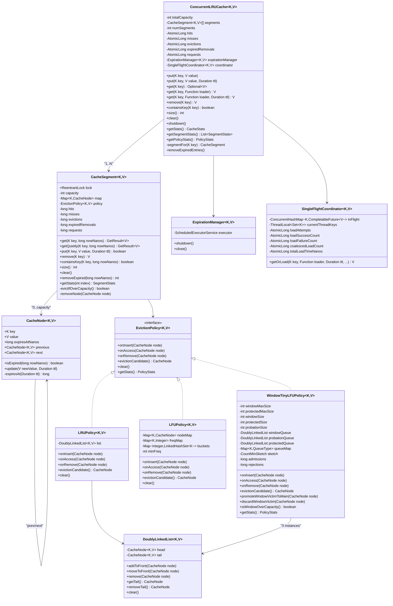
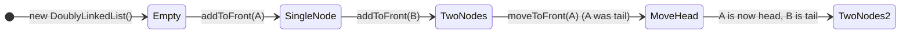
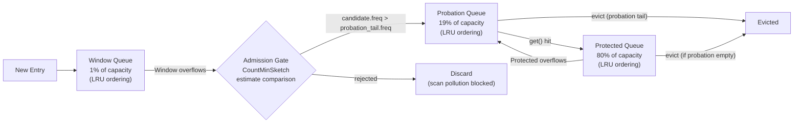
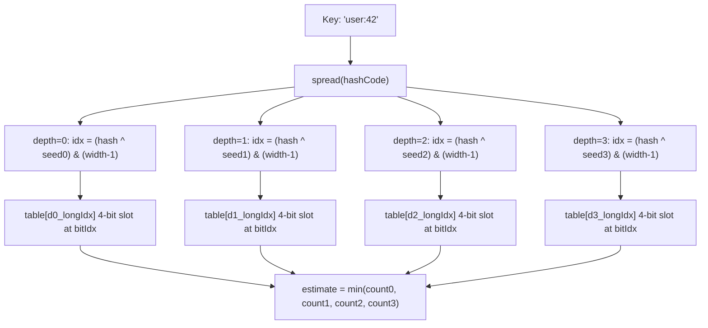

# Low Level Design — ConcurrentLRUCache

## Table of Contents

1. [What LLD Covers](#1-what-lld-covers)
2. [Class Diagram — Full System](#2-class-diagram--full-system)
3. [CacheNode — The Fundamental Unit](#3-cachenode--the-fundamental-unit)
4. [DoublyLinkedList — The Ordering Structure](#4-doublylinkedlist--the-ordering-structure)
5. [EvictionPolicy Interface](#5-evictionpolicy-interface)
6. [LRUPolicy — Implementation Deep Dive](#6-lrupolicy--implementation-deep-dive)
7. [LFUPolicy — Implementation Deep Dive](#7-lfupolicy--implementation-deep-dive)
8. [WindowTinyLFUPolicy — Implementation Deep Dive](#8-windowtinylfu-policy--implementation-deep-dive)
9. [CacheSegment — The Atomic Unit of Concurrency](#9-cachesegment--the-atomic-unit-of-concurrency)
10. [ConcurrentLRUCache — Orchestration Layer](#10-concurrentlrucache--orchestration-layer)
11. [ExpirationManager — TTL Lifecycle](#11-expirationmanager--ttl-lifecycle)
12. [SingleFlightCoordinator — Stampede Prevention](#12-singleflightcoordinator--stampede-prevention)
13. [Metrics and Records](#13-metrics-and-records)
14. [Critical Code Paths — Step by Step](#14-critical-code-paths--step-by-step)
15. [Invariants and Correctness Proofs](#15-invariants-and-correctness-proofs)
16. [Feynman-Style Interview Q&A](#16-feynman-style-interview-qa)

---

## 1. What LLD Covers

The High Level Design explains *what* the system does and *why* each component exists.

The Low Level Design explains *how* each component is implemented — the exact data structures, the locking protocol, the memory layout, the edge cases, and the specific line-by-line reasoning behind each decision.

This document answers:

- What data structure sits inside each component and why that specific structure?
- What exactly happens when a lock is acquired and released?
- Where exactly is each counter incremented and why?
- What are the edge cases that can corrupt state, and how are they prevented?
- How does each algorithm achieve O(1) complexity?

---

## 2. Class Diagram — Full System



---

## 3. CacheNode — The Fundamental Unit

### Data layout

```
CacheNode<K, V>
├── key             K        (immutable after construction)
├── value           V        (mutable — updated by put() on existing key)
├── expiresAtNanos  long     (System.nanoTime() + ttl, or Long.MAX_VALUE if no TTL)
├── previous        CacheNode (doubly-linked list pointer — used by LRU / WindowTinyLFU)
└── next            CacheNode (doubly-linked list pointer — used by LRU / WindowTinyLFU)
```

### TTL encoding

```java
private long expiresAt(Duration ttl) {
    if (ttl == null) return Long.MAX_VALUE;          // no expiry → max sentinel
    long now = System.nanoTime();
    long expiresAt = now + ttl.toNanos();
    return expiresAt < now ? Long.MAX_VALUE : expiresAt;  // overflow guard
}
```

The overflow guard is subtle but critical: `long` nanosecond arithmetic can overflow if TTL is very large (e.g., `Duration.ofDays(Long.MAX_VALUE / 86_400_000_000_000L)`). If addition overflows, the result would be negative — meaning the entry would appear immediately expired. The guard collapses any overflowing TTL to `Long.MAX_VALUE` (no expiry) instead.

### Expiry check

```java
boolean isExpired(long nowNanos) {
    return nowNanos >= expiresAtNanos;
}
```

This is a single comparison with no lock needed — `expiresAtNanos` is written exactly once (on construction or on update) while the segment lock is held, and read only while the segment lock is held.

### Why store `previous` and `next` directly on the node

Instead of using a wrapper/entry object that holds a pointer to the node, the pointers are embedded directly in `CacheNode`. This means:

- **No extra object allocation** per entry for the linked list structure.
- **No pointer chasing** — the map lookup returns the node; the same object is used for both map access and list manipulation.
- The LFU policy does not use these pointers (it has its own bucket structure), so for LFU the fields are wasted — but this is a minor memory cost compared to the elimination of wrapper objects.

---

## 4. DoublyLinkedList — The Ordering Structure



### State

```
head ──► [Node A] ⇄ [Node B] ⇄ [Node C] ◄── tail
```

- `head` = Most Recently Used (MRU)
- `tail` = Least Recently Used (LRU) — the eviction candidate

### `addToFront(node)` — O(1)

```
Before: head → [B] → [C] ← tail
After:  head → [A] → [B] → [C] ← tail

Steps:
1. node.next = head
2. if head != null: head.previous = node
3. head = node
4. if tail == null: tail = node  (first node case)
```

### `moveToFront(node)` — O(1)

```
Before: head → [A] → [B] → [C] ← tail  (accessing C)
After:  head → [C] → [A] → [B] ← tail

Steps:
1. if node == head: return (already front)
2. remove(node)   (O(1) pointer surgery)
3. addToFront(node)
```

### `remove(node)` — O(1) via direct pointer access

```java
CacheNode previous = node.previous;
CacheNode next = node.next;
if (previous != null) previous.next = next; else head = next;
if (next != null)     next.previous = previous; else tail = previous;
node.previous = null;
node.next = null;
```

Critically, this is O(1) because we have *direct* access to the node's previous and next pointers. A standard `java.util.LinkedList` removal is O(n) because you must traverse to find the node. Here, the node reference is already known (retrieved from the `HashMap` in the same lock window), so removal is pure pointer surgery.

### `clear()` — Explicit pointer nulling

```java
CacheNode current = head;
while (current != null) {
    CacheNode next = current.next;
    current.previous = null;
    current.next = null;
    current = next;
}
head = null;
tail = null;
```

All node pointers are explicitly nulled. This allows the GC to collect nodes immediately — otherwise inter-node references would keep all nodes alive until the `head` and `tail` references were cleared.

---

## 5. EvictionPolicy Interface

```java
interface EvictionPolicy<K, V> {
    void onInsert(CacheNode<K, V> node);         // called when a new node enters the cache
    void onAccess(CacheNode<K, V> node);         // called on cache hit
    void onRemove(CacheNode<K, V> node);         // called on explicit remove or expiration
    CacheNode<K, V> evictionCandidate();         // return the node to evict (but do NOT remove it)
    void clear();                                 // reset all policy state
    default PolicyStats getStats() { return PolicyStats.empty(); }
}
```

### Design principle: policy does not own the map

The eviction policy **only manages ordering**. It does not own the `HashMap`. When `evictionCandidate()` returns a node, `CacheSegment` calls `map.remove(victim.key, victim)` and then `policy.onRemove(victim)`. The policy itself never touches the map.

This separation ensures that if the map removal fails (e.g., a concurrent thread already removed the key via an explicit `remove()` call), the policy is not left with a dangling reference.

---

## 6. LRUPolicy — Implementation Deep Dive

### Data structure

```
LRUPolicy
└── DoublyLinkedList<K, V>
        head (MRU) → [Node D] ⇄ [Node B] ⇄ [Node A] ← tail (LRU candidate)
```

### All four operations — O(1)

| Event | Operation |
|---|---|
| `onInsert(node)` | `list.addToFront(node)` |
| `onAccess(node)` | `list.moveToFront(node)` |
| `onRemove(node)` | `list.remove(node)` |
| `evictionCandidate()` | `list.getTail()` — just return the tail reference |

### State walkthrough

```
Initial: put(A), put(B), put(C)
List: head → [C] → [B] → [A] ← tail

get(A):  onAccess(A) → moveToFront(A)
List: head → [A] → [C] → [B] ← tail

put(D) with capacity=3 → evict LRU:
  evictionCandidate() → B
  map.remove(B), onRemove(B)
  onInsert(D) → addToFront(D)
List: head → [D] → [A] → [C] ← tail
```

### Why LRU — Feynman explanation

LRU assumes that what you used recently you'll use again soon. Think of a desk. You put the book you just used on top of the pile. When the desk is full and you bring a new book, you toss the one at the very bottom — the one you haven't touched in the longest time. That's LRU. Simple, fast, and works great when your access patterns have temporal locality.

---

## 7. LFUPolicy — Implementation Deep Dive

### Data structure

```
LFUPolicy
├── nodeMap:  HashMap<K, CacheNode>     → key → node (for O(1) node lookup)
├── freqMap:  HashMap<K, Integer>       → key → current frequency
├── buckets:  HashMap<Integer, LinkedHashSet<K>>  → frequency → set of keys at that freq
└── minFreq:  int                       → current minimum frequency in buckets
```

### Why `LinkedHashSet` for each bucket

A `LinkedHashSet` maintains insertion order. This gives O(1) removal and O(1) iteration of the first (oldest at this frequency) element. This is how tie-breaking works: if two keys have the same frequency, the one inserted into the frequency bucket *first* (oldest at that frequency) is evicted — FIFO tie-breaking within each frequency tier.

### `onInsert(node)` — O(1)

```java
nodeMap.put(node.key, node);
freqMap.put(node.key, 1);
buckets.computeIfAbsent(1, k -> new LinkedHashSet<>()).add(node.key);
minFreq = 1;  // newly inserted items always start at frequency 1 → minFreq resets
```

Resetting `minFreq = 1` is correct because a new item always has frequency 1, which is ≤ any existing item's frequency. The minimum can only decrease on insert.

### `onAccess(node)` — O(1)

```java
int freq = freqMap.getOrDefault(key, 0);  // current frequency
// remove from current bucket
bucket.remove(key);
if (bucket.isEmpty()) {
    buckets.remove(freq);
    if (minFreq == freq) minFreq = freq + 1;  // safe: the accessed item moves up, so min increases
}
// insert into next bucket
int newFreq = freq + 1;
freqMap.put(key, newFreq);
buckets.computeIfAbsent(newFreq, k -> new LinkedHashSet<>()).add(key);
```

The `minFreq` increment is only valid when the accessed item was the *only* item at `minFreq`. That's exactly the condition `bucket.isEmpty()` after removal.

### `evictionCandidate()` — O(1)

```java
LinkedHashSet<K> minBucket = buckets.get(minFreq);
K victimKey = minBucket.iterator().next();  // oldest key at minimum frequency
return nodeMap.get(victimKey);
```

`LinkedHashSet.iterator().next()` returns the insertion-order first element — the oldest at this frequency level. This is O(1) because `LinkedHashSet` maintains a linked entry order.

### State walkthrough

```
put(A), put(B), put(C) — all freq=1, minFreq=1
buckets: {1: [A, B, C]}

get(A) → freq(A)=2, get(A) → freq(A)=3, get(B) → freq(B)=2
buckets: {1: [C], 2: [B], 3: [A]}, minFreq=1

put(D) with capacity=3:
  evictionCandidate → key at minFreq(1) → C (oldest at freq=1)
  evict C, onInsert(D)
buckets: {1: [D], 2: [B], 3: [A]}, minFreq=1
```

### Why LFU — Feynman explanation

LFU says: the thing used *most often* is most valuable. Think of a radio station's playlist. The song that gets requested 1000 times a week should stay in the quick-access list. The song requested once last month should go. LFU tracks request counts and always evicts the least requested item. The weakness: a brand-new hit song starts with frequency 0 — it looks worthless until it accumulates requests. That's where Window-TinyLFU helps.

---

## 8. WindowTinyLFU Policy — Implementation Deep Dive

### Three-queue SLRU + admission gate



### Data structure

```
WindowTinyLFUPolicy
├── windowQueue    DoublyLinkedList  (window entries, LRU order)
├── probationQueue DoublyLinkedList  (main segment, recently accessed tier)
├── protectedQueue DoublyLinkedList  (main segment, frequently accessed tier)
├── queueMap       HashMap<K, QueueType>  (which queue is this key in?)
├── sketch         CountMinSketch    (frequency estimator)
├── windowMaxSize  int               (1% of segment capacity)
├── protectedMaxSize int             (80% of main capacity)
├── windowSize / protectedSize / probationSize  int  (current sizes)
└── admissions / rejections  long    (policy telemetry)
```

### `onInsert(node)` — new entries always go to window

```java
windowQueue.addToFront(node);
queueMap.put(node.key, QueueType.WINDOW);
windowSize++;
sketch.increment(node.key);  // record first access in frequency sketch
```

### `onAccess(node)` — promotion logic

```java
QueueType queue = queueMap.get(node.key);
switch (queue) {
    case WINDOW    -> windowQueue.moveToFront(node);     // stays in window, refreshes recency
    case PROBATION -> {
        // promote from probation to protected
        probationQueue.remove(node); probationSize--;
        protectedQueue.addToFront(node); protectedSize++;
        queueMap.put(node.key, QueueType.PROTECTED);
        // if protected overflows, demote tail back to probation
        if (protectedSize > protectedMaxSize) {
            CacheNode demoted = protectedQueue.getTail();
            protectedQueue.remove(demoted); protectedSize--;
            probationQueue.addToFront(demoted); probationSize++;
            queueMap.put(demoted.key, QueueType.PROBATION);
        }
    }
    case PROTECTED -> protectedQueue.moveToFront(node);  // stays protected, refreshes recency
}
sketch.increment(node.key);  // record access in frequency sketch
```

### `promoteWindowVictimToMain` — the admission gate

This is called when `map.size() > capacity` and the window is over capacity:

```java
void promoteWindowVictimToMain(CacheNode node) {
    windowQueue.remove(node);
    windowSize--;

    CacheNode probationVictim = probationQueue.getTail();
    boolean admit = (probationVictim == null)
        || sketch.estimate(node.key) > sketch.estimate(probationVictim.key);

    if (admit) {
        admissions++;
        probationQueue.addToFront(node);
        probationSize++;
        queueMap.put(node.key, QueueType.PROBATION);
    } else {
        rejections++;
        queueMap.remove(node.key);
        // node is NOT put into any queue → it will be garbage collected
    }
}
```

The window victim competes against the probation tail. If the window victim's estimated frequency is lower, it is rejected — preventing a scan entry from displacing a frequently accessed main-cache entry.

### CountMinSketch — frequency estimation



### Bit packing — why 4-bit counters in a `long[]`

Each counter can hold 0–15 (4 bits, MAX_COUNT=15). A single `long` holds 16 such counters (16 × 4 = 64 bits). The sketch depth is 4 rows. This makes memory consumption:

```
memory = DEPTH × (width / 16) × 8 bytes
       = 4 × (capacity × 8 / 16) × 8
       ≈ 16 bytes per estimated key
```

For a 10,000-entry cache: `4 × (80,000/16) × 8 = 160,000 bytes ≈ 156 KB`. This is compact compared to storing per-entry 64-bit access counts.

### Bit manipulation for get/set

```java
// get 4-bit count at (depth, idx)
private int getCount(int depth, int idx) {
    int longIdx = (depth * (width / 16)) + (idx >>> 4);   // which long
    int bitIdx  = (idx & 15) << 2;                         // which 4-bit slot (0,4,8,...60)
    return (int) ((table[longIdx] >>> bitIdx) & 0xFL);
}

// set 4-bit count at (depth, idx)
private void setCount(int depth, int idx, int count) {
    int longIdx = (depth * (width / 16)) + (idx >>> 4);
    int bitIdx  = (idx & 15) << 2;
    table[longIdx] = (table[longIdx] & ~(0xFL << bitIdx)) | ((long) count << bitIdx);
}
```

### Frequency decay — `halve()`

```java
private void halve() {
    for (int i = 0; i < table.length; i++) {
        table[i] = (table[i] >>> 1) & 0x7777777777777777L;
    }
    additions = 0;
}
```

`0x7777...` in binary is `0111 0111 0111 0111...` — a mask that keeps only the lower 3 bits of each 4-bit slot (prevents carry bleed across slots when right-shifting). This right-shifts every 4-bit counter by 1, effectively halving all frequencies atomically in one pass.

Halving is triggered when `additions >= resetThreshold` (= 10 × capacity). This prevents old historical frequency data from permanently dominating over newer access patterns.

### Why Window-TinyLFU — Feynman explanation

Imagine your cache has two zones: a *trial zone* (window) and a *main zone*.

Every new entry goes into the trial zone first. When the trial zone is full and a new entry needs in, we ask: "Is this new trial entry more popular than the *least popular* entry already in the main zone?"

Popularity is tracked by a frequency sketch — a compact counting structure that estimates how many times each key has been seen. If the new trial entry has been seen more, it gets into the main zone. If not, it's discarded.

This solves the LFU cold-start problem (new hot entries start at frequency 0) by giving them a trial window. And it solves the scan-pollution problem (a linear scan that hits each key only once is always rejected by the main zone because its frequency is always below the main zone's well-established entries).

---

## 9. CacheSegment — The Atomic Unit of Concurrency

### Internal state

```
CacheSegment<K, V>
├── lock       ReentrantLock          (all mutations require this lock)
├── capacity   int                    (max entries for this segment)
├── map        HashMap<K, CacheNode>  (O(1) key lookup)
├── policy     EvictionPolicy         (LRU / LFU / WindowTinyLFU)
└── counters   long hits, misses, evictions, expiredRemovals, requests
```

### HashMap initial capacity

```java
this.map = new HashMap<>(Math.max(capacity * 2, 16));
```

Pre-sized to 2× capacity to avoid rehashing during normal operation. `HashMap` rehashes when `size > capacity × loadFactor` (default: `loadFactor = 0.75`). Pre-sizing to 2× ensures the map never triggers a rehash until it holds 2× segment capacity entries — which never happens since we evict before exceeding capacity.

### `get(key, nowNanos)` — annotated

```java
GetResult<V> get(K key, long nowNanos) {
    requests++;                               // count every get attempt
    CacheNode<K, V> node = map.get(key);
    if (node == null) {
        misses++;
        return GetResult.miss();
    }
    if (node.isExpired(nowNanos)) {
        removeNode(node);                     // lazy expiration: remove on access
        misses++;
        expiredRemovals++;
        return GetResult.expired();
    }
    policy.onAccess(node);                    // update recency/frequency
    hits++;
    return GetResult.hit(node.value);
}
```

Note: `nowNanos` is passed in (not called inside `get`) because `ConcurrentLRUCache` calls `System.nanoTime()` once before acquiring the segment lock. This avoids calling the system clock while holding the lock — a minor but measurable latency reduction under high load.

### `put(key, value, ttl)` — annotated

```java
boolean put(K key, V value, Duration ttl) {
    CacheNode<K, V> existing = map.get(key);
    if (existing != null) {
        existing.update(value, ttl);          // update in-place — O(1), no new node, no eviction
        policy.onAccess(existing);            // refresh recency/frequency
        return false;                         // no eviction occurred
    }
    CacheNode<K, V> node = new CacheNode<>(key, value, ttl);
    map.put(key, node);
    policy.onInsert(node);
    boolean evicted = evictIfOverCapacity();
    if (evicted) evictions++;
    return evicted;
}
```

### `evictIfOverCapacity()` — the eviction path

```java
private boolean evictIfOverCapacity() {
    if (map.size() <= capacity) return false;

    // WindowTinyLFU special path: window overflow first
    if (policy instanceof WindowTinyLFUPolicy<K, V> wtlfu && wtlfu.isWindowOverCapacity()) {
        CacheNode<K, V> windowVictim = policy.evictionCandidate();
        if (windowVictim != null) {
            map.remove(windowVictim.key, windowVictim);
            if (!windowVictim.isExpired(System.nanoTime())) {
                wtlfu.promoteWindowVictimToMain(windowVictim);  // try to admit to main
            } else {
                wtlfu.discardWindowVictim(windowVictim);        // already expired → discard
            }
            if (map.size() <= capacity) return true;            // window eviction was enough
        }
    }

    // General path: evict from main (or LRU/LFU tail)
    CacheNode<K, V> victim = policy.evictionCandidate();
    if (victim != null) {
        map.remove(victim.key, victim);
        policy.onRemove(victim);
    }
    return true;
}
```

The `map.remove(victim.key, victim)` uses the two-argument form — conditional removal. It only removes the entry if the value in the map is exactly the `victim` node. This guards against a race where another thread might have already replaced the entry (e.g., a concurrent `put()` for the same key). If the conditional remove fails, the victim has already been replaced, and we should not remove the new entry.

---

## 10. ConcurrentLRUCache — Orchestration Layer

### Segment routing

```java
private CacheSegment<K, V> segmentFor(K key) {
    int index = (key.hashCode() & 0x7FFF_FFFF) % numSegments;
    return segments[index];
}
```

`& 0x7FFF_FFFF` clears the sign bit to ensure the result is non-negative before the modulo operation. Java's `%` operator can return negative values for negative dividends — this mask prevents negative segment indices.

### Capacity distribution across segments

```java
int base = capacity / numSegments;
int remainder = capacity % numSegments;
for (int i = 0; i < numSegments; i++) {
    int segCapacity = Math.max(base + (i < remainder ? 1 : 0), 1);
    this.segments[i] = new CacheSegment<>(segCapacity, createPolicy(policy, segCapacity));
}
```

For `capacity=100, numSegments=16`: `base=6, remainder=4`. Segments 0–3 get capacity 7; segments 4–15 get capacity 6. Total = 4×7 + 12×6 = 28 + 72 = 100. ✓

`Math.max(..., 1)` ensures no segment has zero capacity — which would make it immediately evict every insertion.

### `clear()` — multi-lock acquisition

```java
public void clear() {
    // Acquire all locks in ascending order (deadlock prevention)
    for (CacheSegment<K, V> segment : segments) {
        segment.lock.lock();
    }
    try {
        for (CacheSegment<K, V> segment : segments) {
            segment.clear();
        }
    } finally {
        // Release in reverse order
        for (int i = segments.length - 1; i >= 0; i--) {
            segments[i].lock.unlock();
        }
    }
}
```

Lock ordering: segments are always acquired 0 → N-1. Since every thread that needs multiple segment locks must acquire them in this same order, the circular-wait deadlock condition is structurally impossible.

---

## 11. ExpirationManager — TTL Lifecycle

### Internal structure

```java
executor = Executors.newSingleThreadScheduledExecutor(task -> {
    Thread t = new Thread(task, "cache-expiration-" + THREAD_COUNTER.incrementAndGet());
    t.setDaemon(true);   // daemon: JVM can exit without waiting for this thread
    return t;
});

executor.scheduleWithFixedDelay(
    cleanupTask,
    intervalNanos, intervalNanos, TimeUnit.NANOSECONDS
);
```

### `scheduleWithFixedDelay` vs `scheduleAtFixedRate`

`scheduleAtFixedRate` schedules the next execution `interval` after the *start* of the previous one. If cleanup takes 200ms and interval is 100ms, tasks pile up.

`scheduleWithFixedDelay` schedules the next execution `interval` after the *end* of the previous one. Cleanup runs at most once per interval, regardless of how long it takes. This is the correct choice for a maintenance task where overlapping executions would be harmful.

### `shutdown()`

```java
public void shutdown() {
    executor.shutdownNow();  // interrupts any running cleanup task
}
```

`shutdownNow()` sends an interrupt to the cleanup thread. The `ScheduledExecutorService` will not accept new tasks. In-progress cleanup tasks are interrupted. Since cleanup only holds segment locks for brief periods, any in-progress sweep completes or is interrupted quickly.

After `shutdown()`, the foreground cache API (`put`, `get`, `remove`) continues to work — the cache is still valid. Only the background scheduled sweep stops. Lazy expiration (on `get()`) continues as normal.

---

## 12. SingleFlightCoordinator — Stampede Prevention

### State

```java
ConcurrentHashMap<K, CompletableFuture<V>> inFlight;  // key → in-progress load future
ThreadLocal<Set<K>> currentThreadKeys;                  // per-thread: keys being loaded by this thread
```

### The algorithm — step by step

```
Thread 1 (T1) and Thread 2 (T2) both call get("product:99", loader) concurrently.
Both see a cache miss.

Step 1: Both create a new CompletableFuture<V> promise.

Step 2: T1 calls inFlight.putIfAbsent("product:99", promise_T1)
        → returns null (no existing future) → T1 becomes LEADER.

        T2 calls inFlight.putIfAbsent("product:99", promise_T2)
        → returns promise_T1 (T1 already in flight) → T2 becomes FOLLOWER.

Step 3 (Leader T1):
    - Calls cacheRechecker to guard against concurrent put between miss and claim.
    - Marks "product:99" as loading in currentThreadKeys (re-entrancy guard).
    - Calls loader.apply("product:99") — WITHOUT holding any segment lock.
    - Calls cacheWriter.accept("product:99", result) → cache.put("product:99", result).
    - Calls promise.complete(result).
    - Removes "product:99" from inFlight.
    - Returns result.

Step 3 (Follower T2):
    - Calls active.join() → blocks until T1's promise completes.
    - When promise completes: coalescedLoadCount++.
    - Returns the same result T1 computed — no loader call, no DB round-trip.
```

### Re-entrancy detection

```java
ThreadLocal<Set<K>> currentThreadKeys = ThreadLocal.withInitial(HashSet::new);

// Before loader:
currentThreadKeys.get().add(key);

// Inside loader (recursive call to get(key, loader)):
if (currentThreadKeys.get().contains(key)) {
    throw new IllegalStateException("Recursive load detected for key: " + key);
}
```

Without this guard, a loader that calls `cache.get(sameKey, loader)` would try to `putIfAbsent` a second future for the same key in the same thread. Since the first future is already in `inFlight`, the recursive call would become a follower waiting on the leader — but the leader *is* this same thread. The thread waits on itself → deadlock.

The `ThreadLocal<Set<K>>` tracks which keys are currently being loaded by the calling thread and throws `IllegalStateException` immediately if recursion is detected.

### Failure propagation

```java
} catch (Throwable t) {
    loadFailureCount.incrementAndGet();
    promise.completeExceptionally(t);  // propagates to all followers via join()
    throw unwrap(t);
} finally {
    totalLoadTimeNanos.addAndGet(System.nanoTime() - startNanos);
    inFlight.remove(key, promise);     // always clean up — even on failure
}
```

When the leader fails:
- All followers receive the exception via `active.join()` → wrapped in `CompletionException` → unwrapped to the original exception.
- The `inFlight` map entry is removed in `finally` → the next caller for this key will become a new leader and can retry.
- The failed value is never written to cache.

---

## 13. Metrics and Records

### How metrics flow

```
CacheSegment.get(key)
    → hits++ (plain long, segment-local)
    → return GetResult.HIT

ConcurrentLRUCache.get(key)
    → result = segment.get(key)
    → switch(result.status):
        case HIT  → hits.incrementAndGet()     (AtomicLong)
        case MISS → misses.incrementAndGet()
        case EXPIRED → expiredRemovals++, misses++
```

Metrics are incremented **after** the segment lock is released. The segment-local counters are incremented inside the lock. The global `AtomicLong` counters are incremented outside the lock. This means the global and segment-local counters may have a brief inconsistency window between lock release and atomic increment — but for monitoring purposes, this is acceptable. The invariant `global.hits == sum(segment[i].hits)` holds eventually.

### `CacheStats` record

```java
public record CacheStats(
    long hitCount, long missCount, long evictionCount, long expiredRemovalCount,
    long totalRequests, double hitRate,
    long loadAttempts, long loadSuccessCount, long loadFailureCount,
    long coalescedLoadCount, long totalLoadTimeNanos, double averageLoadLatencyNanos,
    List<SegmentStats> segmentStats, PolicyStats policyStats
) {
    // derived methods:
    double missRate()         { return totalRequests == 0 ? 0.0 : (double) missCount / totalRequests; }
    double coalescingRatio()  { ... }
    String formattedSummary() { ... }
}
```

Java records are immutable value types. Every call to `getStats()` creates a new snapshot — callers cannot hold a "live" stats reference. This is safe and intentional — a snapshot taken at a point in time is a consistent view.

---

## 14. Critical Code Paths — Step by Step

### Path 1: First `put` into an empty segment

```
put("user:1", "Alice")

1. segmentFor("user:1") → segment[hash % 16]
2. segment.lock.lock()
3. segment.map.get("user:1") → null (not found)
4. node = new CacheNode("user:1", "Alice", null)  // expiresAt = Long.MAX_VALUE
5. segment.map.put("user:1", node)
6. policy.onInsert(node)
   → LRU: list.addToFront(node)  [head=node, tail=node]
7. evictIfOverCapacity(): map.size(1) <= capacity → return false
8. segment.lock.unlock()
```

### Path 2: `get` that hits and promotes in LRU

```
get("user:1")

1. segmentFor → segment[same index]
2. requests++ (segment counter)
3. segment.lock.lock()
4. node = map.get("user:1") → found
5. node.isExpired(nowNanos) → false (no TTL)
6. policy.onAccess(node)
   → LRU: list.moveToFront(node)
      → node == head? no
      → list.remove(node)  [unlink node from current position]
      → list.addToFront(node)  [node is now head]
7. hits++ (segment counter)
8. GetResult.hit("Alice")
9. segment.lock.unlock()
10. hits.incrementAndGet()  (global AtomicLong)
11. return Optional.of("Alice")
```

### Path 3: `put` that triggers eviction in LRU

```
Segment capacity = 2, currently has [B (head), A (tail)]
put("C", "Charlie")

1. map.get("C") → null
2. node_C = new CacheNode("C", "Charlie", null)
3. map.put("C", node_C)   // map: {A, B, C}
4. policy.onInsert(node_C)
   → list: [C, B, A]  (C added to front)
5. evictIfOverCapacity():
   → map.size(3) > capacity(2)
   → policy.evictionCandidate() → list.getTail() → node_A
   → map.remove("A", node_A)  // conditional remove
   → policy.onRemove(node_A) → list.remove(node_A)
   → list: [C, B]
   → evictions++
6. return true (eviction happened)
```

### Path 4: Expired entry removed lazily

```
put("session:x", "data", Duration.ofMillis(10))
// 20ms later:
get("session:x")

1. node = map.get("session:x") → found
2. node.isExpired(System.nanoTime()) → true (expiresAtNanos < now)
3. removeNode(node):
   → map.remove("session:x", node)
   → policy.onRemove(node) → list.remove(node)
4. misses++ (segment), expiredRemovals++ (segment)
5. return GetResult.expired()
6. expiredRemovals.incrementAndGet() (global)
7. misses.incrementAndGet() (global)
8. return Optional.empty()
```

---

## 15. Invariants and Correctness Proofs

### Invariant 1: map size never exceeds capacity

**Proof:** Every `put()` that inserts a new key (not an update) immediately calls `evictIfOverCapacity()`. This method loops until `map.size() <= capacity`. Since all `map.put` and `map.remove` operations happen within the segment lock, no other thread can modify `map.size()` between the insert and the eviction. ✓

### Invariant 2: every node in the policy is in the map

**Proof:** Nodes are added to the policy only in `CacheSegment.put()` (via `policy.onInsert(node)`) after `map.put(key, node)`. Nodes are removed from the policy only via `policy.onRemove(node)` which is always preceded by `map.remove(node.key, node)`. All operations happen under the segment lock. ✓

### Invariant 3: expired entries are never returned as valid values

**Proof:** Every `get()` path calls `node.isExpired(nowNanos)` before returning `GetResult.hit()`. If expired, the node is removed and `GetResult.expired()` is returned, which maps to `Optional.empty()`. There is no code path that returns `GetResult.hit()` for an expired node. ✓

### Invariant 4: single-flight loader executes at most once per concurrent miss batch

**Proof:** `inFlight.putIfAbsent(key, promise)` is atomic (ConcurrentHashMap provides this guarantee). Exactly one thread will receive `null` (meaning it inserted successfully) — this thread becomes the leader. All other threads receive the existing future and become followers. Only the leader calls `loader.apply(key)`. ✓

### Invariant 5: `totalRequests == hitCount + missCount`

**Proof:** In `ConcurrentLRUCache.get(key)`:
- `requests.incrementAndGet()` is called unconditionally.
- Then exactly one of `hits.incrementAndGet()` or `misses.incrementAndGet()` is called (EXPIRED also increments misses).
- Therefore `requests == hits + misses` at all times (accounting for brief windows between the segment lock release and the atomic increment of global counters). ✓

---

## 16. Feynman-Style Interview Q&A

---

### Q: "Walk me through exactly what happens when two threads call `get('user:42')` simultaneously."

**Answer:**

Both threads call `segmentFor("user:42")` — they get the same segment (same hash → same index). Now they both try to acquire the segment's `ReentrantLock`. One wins — say Thread 1. Thread 2 blocks at `lock.lock()`.

Thread 1: finds the node in the map, checks TTL (not expired), calls `policy.onAccess(node)` to move the node to the LRU head, increments `hits`, unlocks. Returns the value.

Thread 2: now acquires the lock. The node is still there (Thread 1 didn't remove it). Thread 2 sees a hit too. Calls `onAccess` again (moves node to front — it's already at front, so `moveToFront` returns immediately). Unlocks. Returns the value.

Both get the correct value. No corruption. The sequential execution under the lock is the correctness guarantee.

---

### Q: "Why is `map.remove(victim.key, victim)` used instead of `map.remove(victim.key)`?"

**Answer:**

The two-argument form is a conditional remove: "remove this key only if its current value is exactly this node object." If any other thread has already replaced the entry (a concurrent `put()` inserted a new node under the same key), the conditional remove fails silently — the new node stays in the map.

If we used the single-argument `remove(victim.key)`, we might accidentally remove a *new* node that was just inserted by a concurrent thread, causing a spurious data loss. The conditional remove eliminates this race.

---

### Q: "How does the Count-Min Sketch work at the bit level?"

**Answer:**

The sketch is a `long[]` array. Each `long` holds sixteen 4-bit counters packed tightly (16 × 4 = 64 bits). To get the count for key K at depth D, we:

1. Compute an index: `idx = (hash ^ seed[D]) & (width - 1)` — gives a column index in [0, width).
2. Find which `long` stores it: `longIdx = D * (width/16) + (idx / 16)`.
3. Find which 4-bit slot within that `long`: `bitIdx = (idx % 16) * 4`.
4. Extract: `(table[longIdx] >>> bitIdx) & 0xF`.

To increment, we read, add 1 to the 4-bit slot (being careful not to overflow into adjacent slots), and write back.

The halving operation is a single `table[i] = (table[i] >>> 1) & 0x7777...` per long — right-shifting every 4-bit slot by 1 simultaneously. The mask `0x7777...` prevents the MSB of each slot from bleeding into the adjacent slot during the shift.

---

### Q: "What's the difference between `getQuietly` and `get` in `CacheSegment`?"

**Answer:**

Regular `get` is used for user-visible cache reads. It increments `requests` and `hits`/`misses` counters — these appear in the cache's statistics.

`getQuietly` is used by `SingleFlightCoordinator` for the internal re-check after winning the race to load a key (the "did another thread already put this while I was waiting?" check). This internal lookup should not count as a user request — it would inflate `misses` and `requests` incorrectly. So it skips the `requests++` increment and doesn't count as a miss even if the key isn't there.

The metrics asymmetry between `get` and `getQuietly` is intentional and necessary for metrics accuracy.

---

### Q: "What happens if you call `cache.shutdown()` and then keep using the cache?"

**Answer:**

`shutdown()` only stops the `ExpirationManager` — the background scheduled sweep thread is halted. The foreground cache API (`put`, `get`, `remove`, `size`, `clear`) continues to work normally.

Lazy expiration (the check `node.isExpired(nowNanos)` on every `get()`) still fires. Expired entries are still detected and removed on access.

The only thing that stops is the periodic *background* sweep that proactively removes entries that have expired but haven't been accessed. Over time, if expired entries are never accessed, they accumulate in memory — but this is bounded by the cache's configured capacity, since new puts will trigger capacity eviction regardless.

This behaviour is tested explicitly in `TtlHardeningTest.foregroundOpsWorkAfterShutdown()`.

---

### Q: "Why does `CacheNode` embed `previous` and `next` instead of using a wrapper?"

**Answer:**

Memory efficiency and access speed. If we had a separate `LinkedListEntry<CacheNode>` wrapper:

- Every cache entry would require two objects: the `CacheNode` (key + value + TTL) and the `LinkedListEntry` (prev + next + reference to node).
- A cache hit would require: `map.get(key)` → `CacheNode` → `CacheNode.listEntry` → `LinkedListEntry` (extra pointer chase).

By embedding `previous` and `next` directly in `CacheNode`:

- One object per cache entry — 50% less GC pressure.
- `map.get(key)` returns the node directly, and the same object is used for both map access and list manipulation — zero extra indirection.

The cost: LFU doesn't use `previous` and `next` (it has its own frequency bucket structure), so those two fields are wasted for LFU entries. For a realistic cache with thousands of entries, this is 16 bytes per entry of waste — acceptable for the 50% object-count reduction in LRU/WindowTinyLFU mode.
