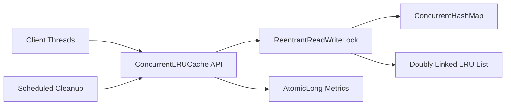

# Architecture

ConcurrentLRUCache combines a `ConcurrentHashMap` for key lookup with a custom doubly linked list for recency ordering. The map provides direct access to nodes, while the list keeps the most recently used entry at the head and the least recently used entry at the tail.

## Concurrency Design

Reads that update recency use the write lock because the linked list is mutated. Pure checks such as `containsKey` and `size` use the read lock. Counters use `AtomicLong` so metric updates do not require the cache lock.

The map and list are updated under the same lock so they do not drift out of sync.

## Time Complexity

| Operation | Complexity |
| --- | --- |
| `get` | O(1) |
| `put` | O(1) |
| `remove` | O(1) |
| `containsKey` | O(1) |
| `clear` | O(n) |

TTL cleanup scans entries periodically, so cleanup is O(n). Lazy expiration during `get` remains O(1).
