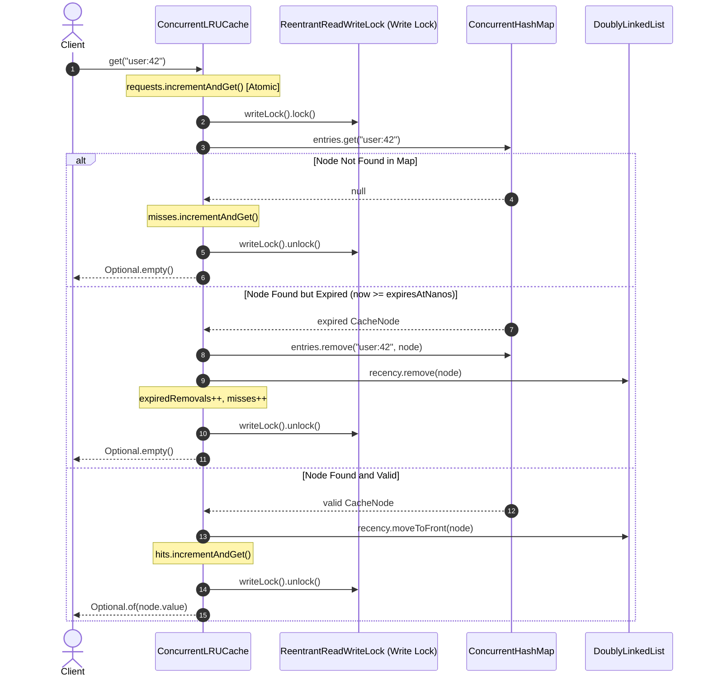
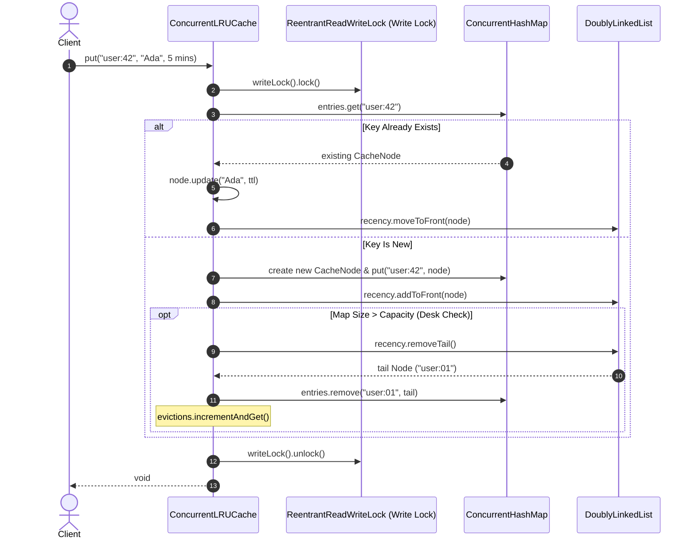

# Concurrent LRU Cache: The Ultimate Feynman-Style Architecture & Interview Guide

> *"If you can't explain it simply, you don't understand it well enough."* — Richard Feynman

Welcome! This is the comprehensive, all-in-one guide for the **`ConcurrentLRUCache`** project—a thread-safe, high-performance in-memory cache written in **Java 21**. 

Whether you are reviewing this code for the first time, refreshing your knowledge on concurrency primitives, or preparing for high-stakes technical interviews (such as Google L4/L5 Systems & Concurrency rounds), this document breaks down **every single concept** from first principles using intuitive real-world analogies, step-by-step memory flows, exact JVM byte calculations, and advanced architectural self-critiques.

---

## Table of Contents
1. [First Principles & High-Level Intuition](#1-first-principles--high-level-intuition)
2. [Core Architecture & The Hybrid Data Structure](#2-core-architecture--the-hybrid-data-structure)
3. [Step-by-Step Execution Workflows](#3-step-by-step-execution-workflows)
4. [Concurrency & Thread Safety Mechanics](#4-concurrency--thread-safety-mechanics)
5. [TTL Expiration Engine: Dual-Strategy & Monotonic Clocks](#5-ttl-expiration-engine-dual-strategy--monotonic-clocks)
6. [JVM Memory Physics & Garbage Collection](#6-jvm-memory-physics--garbage-collection)
7. [Advanced Technical Deep Dive & Production Critiques](#7-advanced-technical-deep-dive--production-critiques)
8. [Interview Battle Plan & Q&A Master Cheat Sheet](#8-interview-battle-plan--qa-master-cheat-sheet)

---

## 1. First Principles & High-Level Intuition

### 1.1 What Problem Are We Trying to Solve?

Imagine you run a high-traffic web application. Every time a user visits their profile, your server queries a database: *"What is user 42's profile data?"*

- **Databases are like filing cabinets in another room:** Fetching data from disk or over a network is slow.
- **Memory is like your small desk:** Reading data stored in RAM takes nanoseconds.

If 1,000 users ask for user 42's profile in the same second, making 1,000 trips to the filing cabinet is wasteful and slow. Instead, you fetch the file once, write a sticky note, and keep it on your desk. The next 999 users read the sticky note off your desk instantly.

However, your desk has physical limits:
1. **Limited Desk Space (Capacity Limit):** Your desk can only hold so many files before spilling over.
2. **Stale Information (Time-To-Live / TTL):** Some files contain time-sensitive data (e.g., login tokens) that spoil after a few minutes.
3. **Multiple People at the Desk (Thread Safety):** If 50 baristas or workers reach for files on the same desk simultaneously, they will knock files over, grab the same paper, or corrupt the physical pile unless strict ordering rules exist.

This library, **`ConcurrentLRUCache`**, is that high-speed, memory-bounded, auto-expiring, thread-safe desk shelf.

---

### 1.2 Terminology Breakdown

| Term | Simple Meaning | Real-World Analogy |
| :--- | :--- | :--- |
| **Cache** | A fast, temporary in-memory store for frequently accessed data. | Sticky notes kept on your working desk instead of walking to the basement archive. |
| **LRU** *(Least Recently Used)* | When the cache is full, throw away the item that has gone untouched for the longest time. | Throwing away the oldest pastry on the coffee shop counter to make room for fresh ones. |
| **Concurrent** | Multiple threads (workers) can read and write safely at the exact same time without data corruption. | Multiple baristas serving customers at the same counter without crashing into each other. |
| **TTL** *(Time-To-Live)* | An optional expiration window (e.g., 5 minutes) after which an entry automatically becomes invalid. | An expiration date stamped on an iced drink that gets discarded after melting. |

---

### 1.3 The Coffee Shop & Pastry Counter Analogy

Imagine a busy coffee shop with a display counter holding ready-made pastries:

- **The Cashier's Screen (`ConcurrentHashMap`):** Instantly tells the cashier: *"Croissant #42 is on tray 3."*
- **The Physical Freshness Trays (`DoublyLinkedList`):** Pastries are lined up by freshness. The croissant baked 2 minutes ago is at the **front** (Head). The pastry touched 2 hours ago is at the **back** (Tail).
- **The LRU Rule:** When the counter is full and a baker brings out a muffin, the cashier discards the untouched pastry at the **back** of the line (Tail).
- **The TTL Rule:** Pastries have a "discard after 1 hour" label. Even if space remains, stale pastries are thrown out.
- **Concurrency (Locks):** A coordinator ensures two cashiers don't grab the same tray simultaneously.

---

## 2. Core Architecture & The Hybrid Data Structure

To achieve **$O(1)$ constant time** for key lookups AND **$O(1)$ constant time** for updating usage order, a single data structure is mathematically insufficient. We pair **two data structures together**:

```
                              ┌─────────────────────────────────────────┐
                              │           ConcurrentLRUCache            │
                              └────────────────────┬────────────────────┘
                                                   │
                 ┌─────────────────────────────────┴─────────────────────────────────┐
                 │                                                                   │
                 ▼                                                                   ▼
    ┌─────────────────────────┐                                         ┌─────────────────────────┐
    │   ConcurrentHashMap     │                                         │    DoublyLinkedList     │
    │  (Card Catalog Index)   │                                         │   (Freshness Lineup)    │
    │   Key -> CacheNode      │                                         │ Head (MRU) <-> Tail(LRU)│
    └────────────┬────────────┘                                         └────────────┬────────────┘
                 │                                                                   │
                 │   O(1) Direct Key Lookup                                          │ Head = Most Recent
                 └───────────────────────────────┐                                   │ Tail = Least Recent
                                                 ▼                                   │
                                      ┌────────────────────┐                         │
                                      │     CacheNode      │◄────────────────────────┘
                                      ├────────────────────┤
                                      │ K key              │
                                      │ V value            │
                                      │ long expiresAtNanos│
                                      │ CacheNode previous │
                                      │ CacheNode next     │
                                      └────────────────────┘
```

### 2.1 The Librarian Analogy: Why One Data Structure Fails

| Data Structure | Lookup by Key | Move Item to Front | Evict Oldest Item | Why It Fails Alone |
| :--- | :--- | :--- | :--- | :--- |
| **Array / ArrayList** | $O(N)$ (scan elements) | $O(N)$ (shift array slots) | $O(N)$ | Searching and shifting items degrades under load. |
| **Standard HashMap** | **$O(1)$** | Impossible | $O(N)$ (no ordering) | Has no concept of recency or element order. |
| **Singly Linked List**| $O(N)$ (traverse nodes)| $O(1)$ (if node known) | $O(1)$ | Searching by key takes linear time. |
| **Doubly Linked List**| $O(N)$ (traverse nodes)| **$O(1)$** (rewire pointers) | **$O(1)$** (remove tail) | Cannot find a node by key without scanning every node. |
| **HashMap + DoublyLinkedList** | **$O(1)$** | **$O(1)$** | **$O(1)$** | **PERFECT HYBRID ARCHITECTURE!** |

### 2.2 The Core Building Blocks in Source Code

1. **`CacheNode.java` (The Box / Folder):**
   - Holds `K key`, `V value`, `long expiresAtNanos`.
   - Holds memory pointers `CacheNode<K,V> previous` and `CacheNode<K,V> next`.
2. **`DoublyLinkedList.java` (The Lineup):**
   - Keeps track of `head` (Most Recently Used / MRU) and `tail` (Least Recently Used / LRU).
   - Exposes $O(1)$ methods: `addToFront(node)`, `moveToFront(node)`, `remove(node)`, `removeTail()`.
3. **`ConcurrentHashMap<K, CacheNode<K,V>>` (The Card Catalog Index):**
   - Maps the lookup key `K` directly to the `CacheNode` reference in heap memory in $O(1)$ time.

---

## 3. Step-by-Step Execution Workflows

### 3.1 Read Workflow: `get(key)`



---

### 3.2 Write Workflow: `put(key, value, ttl)`



---

### 3.3 Clear Workflow: `clear()`

When clearing the cache, `ConcurrentLRUCache` acquires the write lock and performs two operations:
1. `entries.clear()`: Empties the hash map index.
2. `recency.clear()`: Explicitly traverses the doubly linked list from `head` to `tail`, unlinking every node by setting `current.previous = null` and `current.next = null`.

> **Why explicit link severing?** Severing node links prevents GC pressure and object graph retention issues (discussed in Section 6).

---

## 4. Concurrency & Thread Safety Mechanics

### 4.1 The Bouncer at the Door: `ReentrantReadWriteLock`

To prevent data corruption when multiple threads access the cache, `ConcurrentLRUCache` utilizes a `ReentrantReadWriteLock`.

- **Read Lock (`readLock()`):** Allows **multiple threads** to execute concurrently, provided no thread is writing.
- **Write Lock (`writeLock()`):** Grants **exclusive access** to a single thread. All other readers and writers are blocked until the write lock is released.

---

### 4.2 ⚠️ The Infamous `get()` Trap (Must Know for Interviews)

> **Interviewer:** *"If I call `get(key)` on your cache, does it acquire a Read Lock or a Write Lock?"*  
> **Candidate:** *"It acquires a **Write Lock**."*  
> **Interviewer:** *"Why? `get()` is just reading data from the cache!"*  
> **Candidate:** *"Because in an LRU cache, a successful `get()` mutates internal state. It calls `recency.moveToFront(node)`, which rewires `previous` and `next` memory pointers on the shared linked list. Modifying pointers on a shared data structure is a structural write operation. Therefore, `get()` must acquire the Write Lock to prevent pointer corruption and race conditions."*

---

### 4.3 Lock Granularity & Method Summary

| Method | Lock Type | Mutates Linked List? | Concurrent Execution Behavior |
| :--- | :--- | :--- | :--- |
| `put()` | **Write Lock** | Yes (`addToFront` / `moveToFront` / `removeTail`) | Serialized exclusively. |
| `get()` | **Write Lock** | Yes (`moveToFront` or `removeExpiredNode`) | Serialized exclusively. |
| `remove()` | **Write Lock** | Yes (`remove`) | Serialized exclusively. |
| `clear()` | **Write Lock** | Yes (`clear`) | Serialized exclusively. |
| `containsKey()`| **Read Lock** | **No** (pure check) | **Concurrent!** Multiple readers execute simultaneously. |
| `size()` | **Read Lock** | **No** (pure check) | **Concurrent!** Multiple readers execute simultaneously. |
| Metrics (`getHitCount`, etc.)| **No Lock** | **No** (Atomic counters) | **Lock-Free!** Operates outside the lock boundary. |

---

### 4.4 Lock-Free Metrics Tracking (`AtomicLong`)

Metrics (`hits`, `misses`, `evictions`, `expiredRemovals`, `requests`) use Java's `AtomicLong`.

**Why track metrics outside the ReadWriteLock?**
If metric updates were done using standard `long` variables inside the write lock, calling `getHitRate()` or `getStats()` would require acquiring the lock, increasing lock hold times. `AtomicLong` uses CPU-level hardware instructions (Compare-And-Swap / CAS) to update counters safely without extending lock hold duration.

---

## 5. TTL Expiration Engine: Dual-Strategy & Monotonic Clocks

The cache implements a **Dual-Strategy Expiration Mechanism** to ensure expired items are reclaimed efficiently.

```
                              ┌───────────────────────────────────┐
                              │       Cache Item with TTL         │
                              └─────────────────┬─────────────────┘
                                                │
                       ┌────────────────────────┴────────────────────────┐
                       ▼                                                 ▼
            [Strategy 1: Passive / Lazy]                      [Strategy 2: Active / Background]
            Triggered on get(key)                             Triggered by ExpirationManager
            - Checks System.nanoTime()                        - Scheduled single-thread executor
            - Deletes item if expired                         - Scans map every 60 seconds (default)
            - Instant cleanup for hot keys                    - Sweeps abandoned / unread expired keys
```

### 5.1 Passive (Lazy) Expiration
When a client calls `get(key)`, the cache compares the node's `expiresAtNanos` against `System.nanoTime()`. If `now >= expiresAtNanos`, the node is evicted immediately during the call.

### 5.2 Active (Background Janitor) Expiration: `ExpirationManager`
What if an entry with a 5-minute TTL is put into the cache, but no client ever calls `get()` on it again?
Without background cleanup, that unread expired entry would sit in memory indefinitely until pushed out by capacity limits.

`ExpirationManager.java` solves this:
- Initializes a `ScheduledExecutorService` with a single daemon thread named `cache-expiration-N`.
- Schedules `removeExpiredEntries()` at a fixed delay (default: every 60 seconds).
- `removeExpiredEntries()` acquires the write lock, iterates over `entries.values()`, identifies expired nodes, and unlinks them from both the map and the linked list.

---

### 5.3 Monotonic Clock vs. Wall-Clock Time: `System.nanoTime()`

> **Crucial Design Choice:** `CacheNode` uses `System.nanoTime()` instead of `System.currentTimeMillis()`.

- **`System.currentTimeMillis()` (Wall-Clock Time):** Reflects current wall-clock time. If an operating system synchronizes time via NTP (Network Time Protocol) and shifts the clock backward by 10 seconds, items with a 5-second TTL would suddenly stay "unexpired" for longer than intended, or expire prematurely if the clock shifts forward.
- **`System.nanoTime()` (Monotonic Time):** Measures high-resolution CPU tick counts from an arbitrary fixed point. It **never runs backward**, making time-difference calculations completely immune to server clock adjustments.

---

## 6. JVM Memory Physics & Garbage Collection

### 6.1 Exact Memory Calculation per `CacheNode`

Let's compute the exact memory footprint of a single `CacheNode` on a standard **64-bit JVM with Compressed OOPs** (Ordinary Object Pointers enabled, which is default for heaps under 32GB):

```text
┌─────────────────────────────────────────────────────────┐
│ CacheNode Object Layout (64-bit JVM + Compressed OOPs)   │
├──────────────────────────────────────────┬──────────────┤
│ Component                                │ Size (Bytes) │
├──────────────────────────────────────────┼──────────────┤
│ Mark Word                                │ 8 bytes      │
│ Klass Word (Compressed)                  │ 4 bytes      │
│ K key reference (Compressed OOP)         │ 4 bytes      │
│ V value reference (Compressed OOP)       │ 4 bytes      │
│ long expiresAtNanos                      │ 8 bytes      │
│ CacheNode previous reference (Comp. OOP) │ 4 bytes      │
│ CacheNode next reference (Comp. OOP)     │ 4 bytes      │
├──────────────────────────────────────────┼──────────────┤
│ Total Shallow Object Size                │ 36 bytes     │
│ JVM 8-byte Alignment Padding             │ +4 bytes     │
├──────────────────────────────────────────┼──────────────┤
│ Final Padded CacheNode Footprint         │ 40 bytes     │
└──────────────────────────────────────────┴──────────────┘
```

> **Summary:** Each node consumes **40 bytes** of shallow heap memory (excluding the actual Key/Value objects and `ConcurrentHashMap.Node` wrapper overhead).

---

### 6.2 Why `clear()` Explicitly Severs Pointers

In `DoublyLinkedList.java`, the `clear()` method iterates through all nodes and nullifies pointers:

```java
void clear() {
    CacheNode<K, V> current = head;
    while (current != null) {
        CacheNode<K, V> next = current.next;
        current.previous = null;
        current.next = null;
        current = next;
    }
    head = null;
    tail = null;
}
```

> **Interview Q:** *"Why iterate and set `previous = null` and `next = null`? Wouldn't setting `head = null` and `tail = null` let Java's Garbage Collector clean up everything anyway?"*  
> **Answer:** *"If you only drop `head` and `tail`, a massive chain of thousands of interconnected objects remains in heap memory. Java's Generational Garbage Collector must traverse the object reference graph during mark-and-sweep cycles. A long, interconnected object chain can delay GC collection or cause nodes to be promoted to the Old Generation. By explicitly severing `previous` and `next` links, nodes become isolated 0-reference objects, allowing the Young Generation GC to reclaim memory faster and with lower CPU overhead."*

---

## 7. Advanced Technical Deep Dive & Production Critiques

To pass senior systems rounds (e.g., Google L4/L5), you must demonstrate **self-critique** by identifying limitations in your design and explaining how to scale it for production.

---

### Critique 1: Bottleneck of `ReentrantReadWriteLock` under Heavy Read Load

- **The Limitation:** Because `get()` takes a write lock to update recency, read throughput is serialized. Under 100 concurrent threads executing 90% reads, threads queue up waiting for the write lock.
- **The Production Fix (Caffeine / Guava Cache Approach):**
  Decouple the read path from recency updates using **Asynchronous Ring Buffers / Lossy Concurrent Queues**.
  1. `get()` reads the value from `ConcurrentHashMap` without taking any lock ($O(1)$ lock-free read).
  2. `get()` records the read access event (e.g., node ID) by emitting it to a lock-free `ConcurrentLinkedQueue` or thread-local Ring Buffer.
  3. A background thread (or subsequent `put` operation) drains the access queue in batches and updates the doubly linked list recency order asynchronously.

---

### Critique 2: CAS Contention & False Sharing on `AtomicLong`

- **The Limitation:** Under extreme concurrency (e.g., 200 threads hammering `get()`), `AtomicLong` counters (`hits`, `misses`, `requests`) suffer from high CPU spin-retry loops due to CAS (Compare-And-Swap) contention. Furthermore, adjacent `AtomicLong` fields share the same 64-byte CPU Cache Line, triggering **False Sharing** (where CPU Core 1 updating `hits` invalidates the CPU L1 cache line of CPU Core 2 updating `misses`).
- **The Production Fix:** Replace `AtomicLong` with **`java.util.concurrent.atomic.LongAdder`**.
  `LongAdder` maintains a cell array of counters per thread/core. Threads update their local cell without CAS contention or cache line invalidation. The final total is aggregated only when `getStats()` is invoked.

---

### Critique 3: Silent Thread Death in `ScheduledExecutorService`

- **The Limitation:** In standard `ScheduledExecutorService`, if a scheduled background task throws an unhandled `RuntimeException`, the executor **silently suppresses all future executions** of that task without crashing the application. The background cleanup worker would die silently, causing expired entries to leak in memory.
- **The Production Fix:** Wrap the execution logic inside `ExpirationManager` with a defensive `try-catch (Throwable t)` block:

```java
executor.scheduleWithFixedDelay(() -> {
    try {
        cleanupTask.run();
    } catch (Throwable t) {
        LOGGER.error("Unexpected error during scheduled cache cleanup", t);
    }
}, intervalNanos, intervalNanos, TimeUnit.NANOSECONDS);
```

---

### Critique 4: The Thundering Herd Problem (Cache Stampede)

- **The Limitation:** If a popular cache item with a 5-minute TTL expires, 1,000 concurrent client requests might miss the cache simultaneously and all query the database for the exact same key at the same instant, overwhelming the database.
- **The Production Fix (Request Coalescing):** Implement `getOrCompute(K key, Function<K, V> loader)`. Under the hood, leverage `ConcurrentHashMap.computeIfAbsent()`. This ensures that only **one thread** computes/fetches the missing value while the other 999 threads block on the map bucket lock and receive the computed result instantly.

---

### Critique 5: Disallowing `null` Keys and Values

- **Design Decision:** `ConcurrentLRUCache` throws `NullPointerException` if a `null` key or value is passed.
- **Rationale (Doug Lea's Concurrency Principle):** In concurrent maps, returning `null` creates ambiguity: does `get(key) == null` mean the key was not present, or that the key was present and mapped to `null`? In multithreaded environments, checking `containsKey(key)` before `get(key)` creates a race condition. Thus, prohibiting `null` eliminates ambiguity.

---

### Critique 6: Distributed Scaling Strategy (Two-Tier Architecture)

- **The Limitation:** An in-memory cache is confined to a single JVM instance. If you scale to 50 API microservices, each node maintains its own cold cache with low hit rates.
- **The Production Architecture:** Implement a **Two-Tier (L1 / L2) Caching Strategy**:
  - **L1 Cache (Local):** `ConcurrentLRUCache` inside each JVM node for ultra-fast sub-microsecond reads of hot keys.
  - **L2 Cache (Distributed):** Redis or Memcached cluster shared across all 50 API microservices.
  - **Invalidation:** Use Redis Pub/Sub or Apache Kafka to broadcast cache invalidation events whenever a key is updated, ensuring L1 caches remain synchronized.

---

## 8. Interview Battle Plan & Q&A Master Cheat Sheet

Use this cheat sheet for fast review before technical interviews:

### Quick Reference Q&A

1. **Q: How does `ConcurrentLRUCache` achieve $O(1)$ time complexity for operations?**
   - **A:** It pairs a `ConcurrentHashMap` (for $O(1)$ key-to-node memory address lookup) with a custom `DoublyLinkedList` (for $O(1)$ pointer unlinking and head insertion).

2. **Q: Why write a custom `DoublyLinkedList` instead of using `java.util.LinkedList`?**
   - **A:** `java.util.LinkedList` does not expose node objects (`CacheNode`). Removing an element requires passing an object value, forcing an $O(N)$ linear search. Our custom list exposes `CacheNode`, enabling instant $O(1)$ pointer swaps via `previous` and `next` references.

3. **Q: Why does `get()` require a Write Lock in your implementation?**
   - **A:** Because reading an entry updates its recency by moving its node to the front of the list (`recency.moveToFront(node)`). Mutating pointers on a shared list is a write operation that requires exclusive locking.

4. **Q: What is the difference between how `containsKey()` and `get()` use locks?**
   - **A:** `containsKey()` acquires the `readLock()` because it does not alter node recency, allowing multiple threads to check existence concurrently. `get()` acquires the `writeLock()` because it mutates list pointers.

5. **Q: Why use `System.nanoTime()` instead of `System.currentTimeMillis()` for TTL?**
   - **A:** `System.currentTimeMillis()` tracks wall-clock time and can jump backward during NTP clock synchronizations. `System.nanoTime()` is a monotonic clock that never moves backward, ensuring accurate TTL calculations.

6. **Q: How does your cache prevent memory leaks from expired keys that are never read again?**
   - **A:** It uses dual expiration: passive check on `get()` and active background cleanup via `ExpirationManager`, which uses a scheduled daemon thread to periodically sweep and remove expired keys.

7. **Q: How would you optimize `get()` performance for a high-throughput system?**
   - **A:** I would decouple reads from recency updates using an asynchronous Ring Buffer or lossy queue (like Caffeine Cache), allowing lock-free reads while a background thread updates the recency list in batches.

8. **Q: Why use `AtomicLong` for metrics instead of primitive `long` variables inside the write lock?**
   - **A:** To keep metric collection out of the core cache lock path. Atomic counters allow reading metrics (`getHitRate()`) without acquiring the cache lock, eliminating lock contention for monitoring.

9. **Q: How does `clear()` assist the Garbage Collector?**
   - **A:** It explicitly sets `previous = null` and `next = null` on all nodes, breaking the object reference graph and allowing generational GC to reclaim isolated nodes quickly without traversing deep reference chains.

10. **Q: How does your cache handle out-of-memory risks?**
    - **A:** The cache enforces a hard `capacity` limit. When full, `evictOverflow()` removes the tail node from both the map and the list, ensuring memory consumption remains bounded.

---

### 🎯 The Senior Engineer Game Plan
When presenting this project in an interview:
1. **Be Proactive:** Bring up the `get()` write lock trade-off before the interviewer asks. Explain that it prioritizes strict consistency, and immediately explain how you would scale it using an asynchronous Ring Buffer.
2. **Highlight Systems Knowledge:** Mention `System.nanoTime()` monotonic time handling, CPU cache line false sharing (`LongAdder`), and GC object graph traversal during `clear()`.
3. **Acknowledge Limitations:** Frame your implementation as a clean, single-node library, and explain how it integrates into a multi-tier distributed architecture (L1 Local + L2 Redis).
