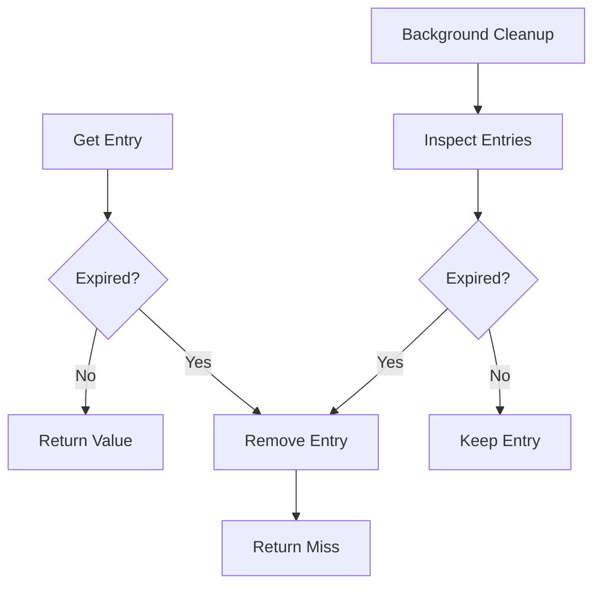

# Phase 4 — TTL and Expiration Hardening

Priority: P1
Gate: Mandatory

Before starting: confirm AGENTS.md is loaded in context.
When finished: fill out the PHASE GATE TEMPLATE from AGENTS.md and STOP. Do not begin the next phase file until I confirm the gate passed.

---

# 13. PHASE 4 — TTL AND EXPIRATION HARDENING

## Objective

Make expiration semantics explicit and race-safe.

Document:

```text
TTL starts when?
TTL checked when?
What happens at exact expiry?
Can expired values be returned?
Can cleanup race with get?
What happens during overwrite?
What happens during remove?
What happens during shutdown?
```

## Target model



Prefer a hybrid strategy:

```text
lazy expiration
+
bounded scheduled cleanup
```

if this matches the repository's needs.

Do not create an unbounded background-thread/resource leak.

## Tests

Test:

- exact boundary
- short TTL
- overwrite
- concurrent expiry
- cleanup race
- removal race
- shutdown
- capacity eviction vs expiration
- metrics
