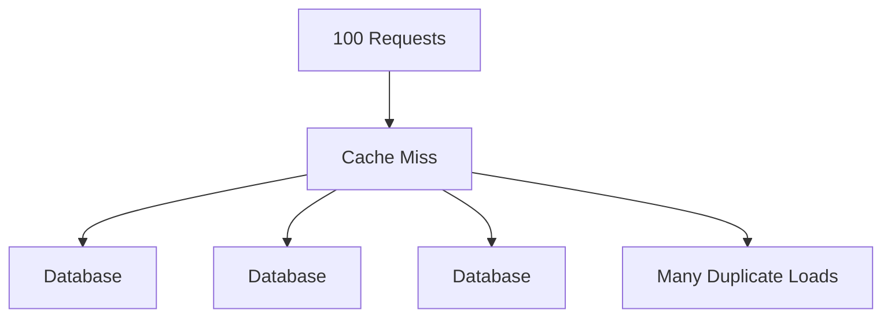
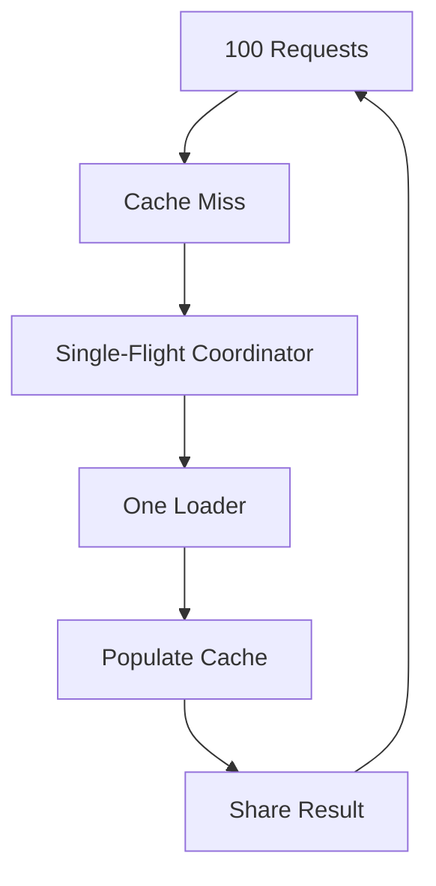

# Phase 5 — Single-Flight / Cache Stampede Protection

Priority: P1
Gate: Recommended

Before starting: confirm AGENTS.md is loaded in context.
When finished: fill out the PHASE GATE TEMPLATE from AGENTS.md and STOP. Do not begin the next phase file until I confirm the gate passed.

---

# 14. PHASE 5 — SINGLE-FLIGHT / CACHE STAMPEDE PROTECTION

## Objective

Prevent many concurrent misses for the same key from triggering the same expensive load simultaneously.

Problem:



Target:



Possible API concept:

```text
getOrLoad(key, loader)
```

The exact public API must be decided after inspecting compatibility requirements.

## Required semantics

Document:

- same-key concurrent misses
- different-key parallelism
- loader failure
- loader timeout if supported
- cancellation if supported
- recursive loading
- exception propagation
- cleanup after completion
- cache population race

Do not hold cache locks while performing arbitrary user loader code.

This is a critical rule.
