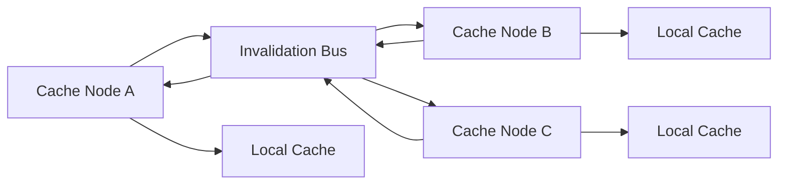

# Phase 7 — One Focused Distributed Capability

Priority: P2
Gate: Optional/high ceiling

Before starting: confirm AGENTS.md is loaded in context.
When finished: fill out the PHASE GATE TEMPLATE from AGENTS.md and STOP. Do not begin the next phase file until I confirm the gate passed.

---

# 16. PHASE 7 — ONE DISTRIBUTED CAPABILITY

## Scope Rule

Choose exactly ONE distributed feature.

Preferred:

> multi-node cache invalidation.

Do not build:

```text
Kubernetes
service mesh
cloud infrastructure
full Redis protocol
distributed consensus
custom database
```

unless there is an exceptional reason.

## Target architecture



Example:

```text
Node A
  |
  | PUT/REMOVE key=user:42
  ↓
Invalidation Event
  |
  ↓
Bus
  |
  ├── Node B → invalidate
  └── Node C → invalidate
```

## Required semantics

Document:

```text
eventual consistency
duplicate events
out-of-order events
lost events
retries
idempotency
node restart
bus failure
network delay
stale-read window
```

The implementation must have an explicit consistency model.

Do not claim strong consistency unless it is actually implemented.

## Failure testing

Test scenarios such as:

```text
duplicate invalidation
delayed invalidation
node unavailable
bus unavailable
node restart
repeated invalidation
```

If an external system is required and credentials/infrastructure are unavailable, STOP and ask rather than silently replacing it with fake behavior.
